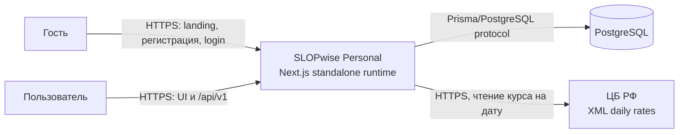
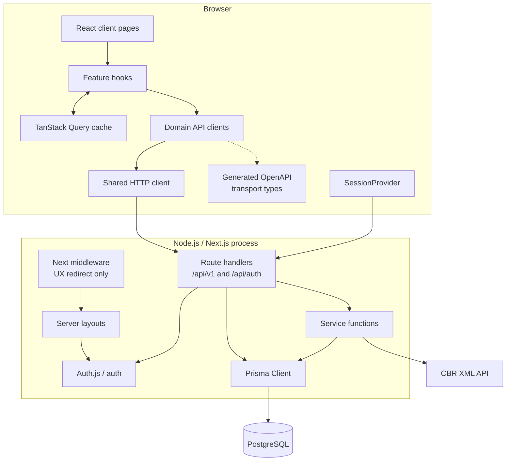
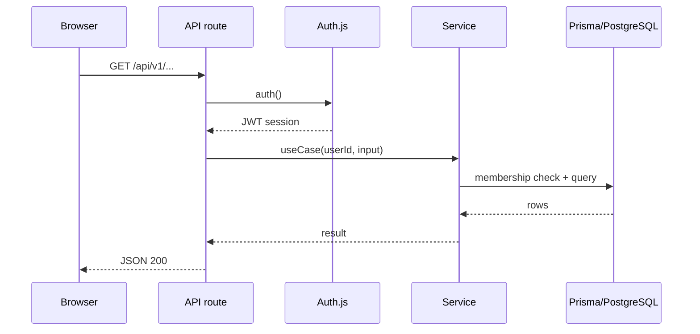
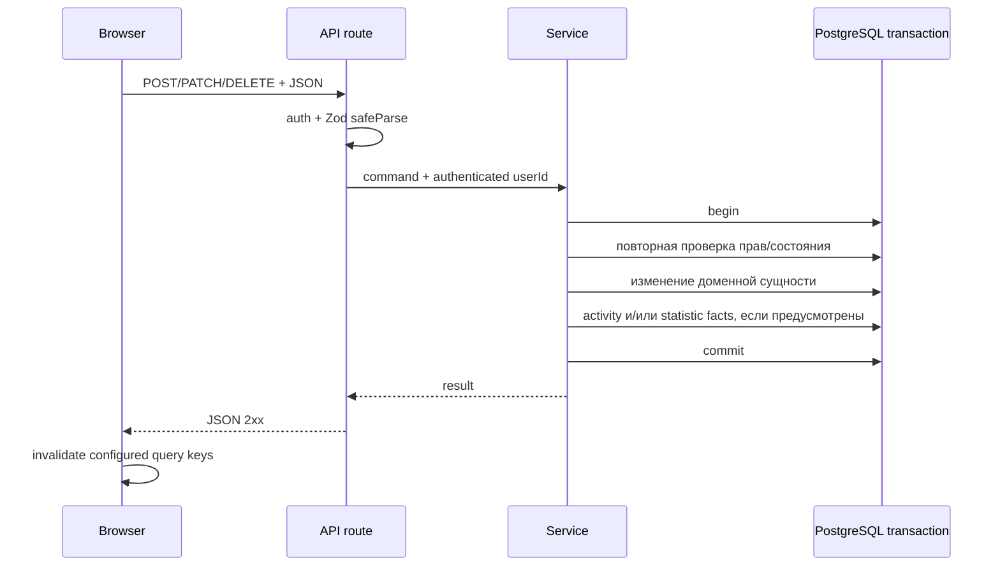

# Системный контекст

## Назначение

Приложение помогает группе людей фиксировать общие расходы, делить их между участниками, вычислять упрощённые долги и регистрировать возвраты. Дополнительные возможности: разные валюты, курсы ЦБ РФ или ручной курс, приглашения, платёжные реквизиты, журнал активности, feedback, lifetime-статистика и достижения.

## Акторы

| Актор | Возможности |
|---|---|
| Гость | Просматривает landing/FAQ, регистрируется, входит в систему |
| Пользователь | Управляет профилем, состоит в группах, создаёт расходы, просматривает баланс, фиксирует собственные расчёты, принимает приглашения |
| Администратор группы | Изменяет и удаляет группу, управляет участниками, отзывает приглашение, сбрасывает ручные расчёты |
| Администратор приложения | Просматривает пользовательский feedback; роль определяется через `ADMIN_EMAIL` |
| ЦБ РФ | Предоставляет дневные курсы валют XML endpoint-ом |
| PostgreSQL | Хранит доменные данные, кэш курсов, audit trail, достижения и lifetime-факты |

## Диаграмма контекста

Браузер никогда не обращается к БД или ЦБ напрямую. Все доверенные операции проходят через server-side код Next.js.

## Контейнеры и runtime

Логическое разделение frontend/backend есть в исходном коде, но физически они поставляются вместе.

### Browser boundary

Большинство прикладных страниц являются client components, но не обращаются к
`/api/v1` напрямую. Путь данных проходит через feature hooks в `src/hooks/api`,
domain API clients и единственный shared HTTP client; transport DTO берутся из
сгенерированных OpenAPI types и преобразуются в независимые frontend ViewModel.
TanStack Query хранит server state, по умолчанию повторяет неуспешный query один
раз и считает данные свежими 60 секунд; invite query отключает retry.
Браузерные проверки улучшают UX, но не считаются защитой или доменной
валидацией.

### Next.js server boundary

Server layouts выполняют обязательную проверку сессии для dashboard/admin UI. Защищённые route handlers повторяют проверку для API; registration остаётся публичным, `/api/auth` обслуживает Auth.js. Сервисы не принимают session object: route извлекает `userId` и передаёт его явным аргументом.

### Data boundary

Prisma Client инкапсулирует SQL-доступ. Схема и миграции рассчитаны на PostgreSQL. Raw balance не материализован и вычисляется on demand из `Expense`, `ExpenseSplit` и `Settlement`; simplified edges при равных позициях могут зависеть от порядка строк.

### External service boundary

Единственная runtime-интеграция с внешней системой — XML API ЦБ РФ. Полученные курсы кэшируются в `ExchangeRate`. Для недоступного точного курса сервис пробует ближайшее известное значение, а если кэша нет — возвращает доменную ошибку `RATE_UNAVAILABLE`, после чего UI предлагает ручной курс.

## Основные синхронные потоки

### Чтение данных

### Критическая core-мутация группы/расхода/расчёта

Profile, requisites, feedback, registration и часть простых операций используют сокращённый поток без всех показанных стадий.

## Архитектурный стиль

Текущее решение ближе всего к модульному монолиту внутри Next.js:

- единый deployable artifact и единый процесс;
- слои разделены каталогами, но не отдельными пакетами;
- сервисы импортируют глобальный Prisma Client напрямую;
- API и UI используют общие validation/helper-модули;
- фоновых worker-ов, очереди сообщений и event bus нет;
- для core mutations производные activity/statistics, предусмотренные сценарием, обновляются синхронно в той же транзакции.

Это упрощает согласованность и локальную разработку, но означает, что HTTP serving, тяжёлые вычисления статистики и внешние запросы за курсами конкурируют за ресурсы одного Node.js процесса.
