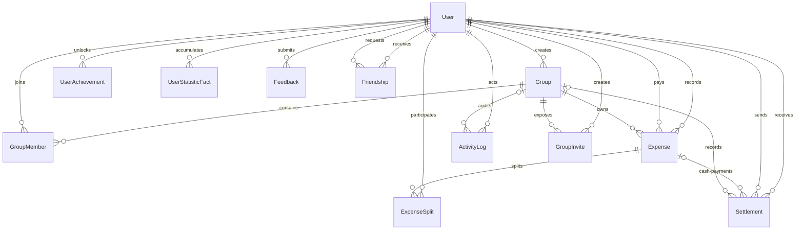

# Домен и модель данных

## Доменные агрегаты

Основной агрегат приложения — группа совместных расходов. Пользователь входит в группу через `GroupMember`, расходы принадлежат группе, а баланс группы выводится из расходов и расчётов.



Диаграмма отражает DB cardinality: `Expense` на уровне БД может иметь ноль splits, а `Settlement.groupId` и `ActivityLog.groupId` nullable. Прикладные сценарии накладывают более строгие ограничения. `ExchangeRate` является самостоятельным справочником-кэшем и не связан внешним ключом с расходом: зафиксированное значение пересчёта хранится непосредственно в `amountBase`.

## Сущности

### User

Учётная запись содержит email, bcrypt hash пароля, имя, необязательный avatar URL и профильные платёжные реквизиты. Email уникален на уровне БД.

Связи пользователя охватывают созданные группы, членства, оплаченные/созданные расходы, доли, отправленные/полученные расчёты, activity, приглашения, feedback, достижения и lifetime-факты.

### Group

Группа задаёт:

- название и описание;
- тип `HOME`, `TRIP`, `COUPLE` или `OTHER`;
- валюту расчёта;
- создателя;
- timestamps.

Текущий API позволяет выбрать тип и валюту только при создании. `updateGroupSchema` изменяет название и описание, поэтому тип и валюта расчёта после создания фактически неизменяемы.

### GroupMember

Связывает пользователя и группу. Пара `(groupId, userId)` уникальна. Повторное вступление реактивирует старую строку через `isActive`, а не создаёт новую.

Роль:

- `ADMIN` — управление группой и участниками;
- `MEMBER` — обычное участие.

Creator становится единственным admin при создании. API назначения дополнительного admin или передачи роли нет; add/reactivate/invite всегда создают `MEMBER`, а admin не может выйти самостоятельно.

Поля реквизитов на членстве переопределяют профильные реквизиты для конкретной группы. `null` означает наследование profile value, а не запрет раскрытия. При выходе membership row, `joinedAt` и реквизиты сохраняются. При повторном добавлении или invite role сбрасывается в `MEMBER`, но прежние реквизиты и `joinedAt` не очищаются.

### Expense

Расход содержит:

- группу;
- фактического плательщика `paidById`;
- пользователя, внёсшего запись, `createdById`;
- название, категорию, заметку и дату операции;
- сумму и валюту исходной операции;
- сумму в валюте расчёта группы;
- необязательный ручной курс;
- способ деления.

Разделение `paidById` и `createdById` важно для прав редактирования, audit trail и статистики.

### ExpenseSplit

Описывает долю одного пользователя в расходе. Пара `(expenseId, userId)` уникальна.

- `amount` — доля в валюте исходной операции;
- `amountBase` — доля в валюте расчёта группы;
- `percentage` — процент в basis points для `PERCENTAGE`;
- `share` — legacy-поле, оставшееся после удаления режима `SHARES`; текущая логика его не использует.

### Settlement

Фиксирует перевод от должника `fromUserId` к получателю `toUserId`.

- Ручной расчёт имеет `expenseId = null` и создаётся в валюте расчёта группы.
- Наличный платёж «на месте» создаётся вместе с расходом и ссылается на него через `expenseId`; `amount/currency` остаются в валюте расхода, а `amountBase` — в валюте группы.
- `amountBase` участвует в расчёте баланса; для ручного расчёта он равен `amount`.

`groupId` и `expenseId` формально nullable в схеме из-за исторической эволюции модели, хотя текущие сервисные сценарии привязывают расчёт к группе.

### ActivityLog

Операционный журнал группы хранит actor, тип события, логические `entityType/entityId`, JSON metadata и время. Поддерживаемые типы:

- создание, изменение и удаление расхода;
- создание или сброс расчётов;
- добавление и удаление участника;
- изменение группы.

Для перечисленных логируемых мутаций Activity создаётся в той же транзакции. Audit coverage частичное: invite create/revoke, profile/requisites, feedback, group create/delete и application-admin actions отдельными событиями не представлены; `entityType/entityId` не являются foreign keys.

### GroupInvite

Многоразовое приглашение с криптографически случайным токеном, ссылкой на группу и создателя. Отзыв выполняется флагом `revoked`; исторические строки сохраняются до удаления группы.

### ExchangeRate

Кэш «сколько RUB стоит одна единица валюты» на календарную дату. `(date, currency)` уникальна. Значение хранится как `Float`, тогда как все денежные суммы — как `Int`. Даже current-day response после fetch сохраняется в БД; unique key и `skipDuplicates` не обновляют его повторно в тот же день.

### UserStatisticFact

Append/update-oriented хранилище lifetime-фактов аккаунта. Уникальный ключ `(userId, kind, reference)` делает запись идемпотентной. Факты переживают удаление исходных групп, расходов и расчётов и используются для статистики и достижений. `kind` — строковый soft dictionary, не DB enum/FK, поэтому БД способна содержать неизвестные application версии значения.

Основные семейства фактов:

- созданные группы и прошлые вступления по типам;
- peers, расходы, участие, оплата и способы деления;
- использованные валюты и ручные курсы;
- отправленные/полученные расчёты и приглашения;
- суммы расходов/возвратов по валютам;
- исторические максимумы размера группы, числа расходов и участников.

### UserAchievement

Сохраняет уже открытое достижение отдельно от вычисляемого прогресса. `notifiedAt = null` означает, что UI ещё должен показать уведомление. Всего в текущем каталоге 49 определений, включая скрытые достижения. `achievementId` также является soft reference на code catalog, без FK; неизвестный persisted ID evaluator не сможет представить пользователю.

### Feedback

Сообщение пользователя для администратора приложения. Список доступен только application admin.

### Friendship

Модель дружбы и enum статуса присутствуют в Prisma-схеме, но текущие сервисы и UI их не используют. Фактическое понятие «люди, с которыми пользователь взаимодействовал» реализовано через совместные группы и lifetime-факты `PEER`.

## Application invariants и DB constraints

Схема БД обеспечивает foreign keys, uniqueness, enums и каскады, но не содержит CHECK constraints для большинства бизнес-правил.

| Инвариант | Где обеспечивается |
|---|---|
| Positive/max исходные expense и settlement amount | Преимущественно Zod boundary; service/DB дают лишь частичные range checks |
| Supported currency | Zod при обычной записи |
| Exact sum равна expense amount | Zod |
| Percentage sum равна 10000 basis points | Zod |
| Payer/split/cash users являются active members | Service, повторно в critical transaction |
| Settlement не self и не превышает suggested debt | Service/Serializable transaction |
| Member removal только при нулевом raw balance | Service/Serializable transaction |
| Group delete только admin и при всех нулевых raw balances | Service/Serializable transaction |
| Admin не может выйти сам | Service |
| `amountBase` соответствует group currency | Service conversion path |
| Settlement с `expenseId` относится к той же группе, payer/split/settlement users состоят в группе | Только service; cross-table DB constraints нет |

Direct Prisma/SQL writer и seed могут обойти эти правила. Nullable legacy-поля дополнительно требуют fallback semantics.

## Денежная модель

### Минимальные единицы

Все суммы хранятся как целые числа в единой внутренней шкале 1/100 отображаемой денежной единицы. UI безусловно умножает ввод на 100 и делит вывод на 100. Для валют без официальной сотой доли, например JPY, это условная прикладная шкала, а не ISO 4217 minor unit.

Предел transport-валидации для расхода — `2_000_000_000`, дополнительная проверка перед БД ограничивает пересчитанное значение диапазоном PostgreSQL `INTEGER` (`2_147_483_647`).

### Две валютные координаты

```text
Expense.amount / ExpenseSplit.amount
    исходная валюта конкретной траты

Expense.amountBase / ExpenseSplit.amountBase
    валюта расчёта группы на дату траты
```

Если валюты совпадают, factor равен 1. Иначе используется ручной `customRate` либо кросс-курс через RUB:

```text
factor(from -> groupCurrency) = rateToRub(from) / rateToRub(groupCurrency)
amountBase = round(amount * factor)
```

Expense total округляется один раз. Для splits применяется largest-remainder allocation со стабильным tie-break по исходному порядку участников, поэтому `sum(ExpenseSplit.amountBase) = Expense.amountBase`. Если positive total или split округлился бы до нуля, запись отклоняется.

Поддерживаются 20 валют: RUB, USD, EUR, AMD, GEL, TRY, THB, AED, GBP, JPY, CNY, CHF, CZK, PLN, HUF, KZT, UZS, BYN, AZN и INR.

### Деление расхода

| Режим | Правило |
|---|---|
| `EQUAL` | Целочисленное деление; остаток добавляется первому участнику |
| `EXACT` | Каждая доля задана явно; сумма долей должна совпадать с расходом |
| `PERCENTAGE` | Проценты задаются basis points и в сумме равны `10000`; округлённый остаток получает первый участник |

Boundary-валидация запрещает пустой список, дубли пользователей, неположительные exact/percentage значения и неверную сумму. Сервис дополнительно проверяет активное членство плательщика, всех участников и участников наличных платежей.

Для `EQUAL`/`PERCENTAGE` вычисленная доля может стать нулевой, если сумма слишком мала относительно числа/процента участников. Плательщик обязан быть active member, но не обязан входить в splits; в таком случае он кредитует все перечисленные доли.

### Наличные платежи при создании расхода

Наличный платёж моделируется как обычный `Settlement`, созданный атомарно вместе с `Expense`:

```text
cash participant -> expense payer
```

Платёж запрещён для самого плательщика, не может дублироваться и превышать долю участника. При изменении плательщика, валюты, курса или даты расхода связанные расчёты синхронно обновляются. При удалении расхода они удаляются каскадно.

В cash-settlement activity поле `actorId` указывает authenticated автора записи расхода, а не обязательно пользователя `fromUserId`, передавшего наличные; последний представлен в metadata.

## Расчёт баланса

Баланс не хранится отдельной таблицей.

1. Для каждого расхода плательщику добавляются доли остальных участников, участникам — вычитаются их доли.
2. Для каждого расчёта отправителю сумма добавляется, получателю — вычитается.
3. Положительные net positions становятся кредиторами, отрицательные — должниками.
4. Два отсортированных списка жадно сопоставляются до погашения всех позиций.

Алгоритм `calculateSimplifiedDebts` является чистой функцией. Он сохраняет итоговый net каждого пользователя, но не обязан находить математически минимальное число переводов для всех возможных графов; это предсказуемая greedy-схема `O(n log n)` после построения net positions.

Вычисление группы использует `amountBase ?? amount` для обратной совместимости со старыми строками без пересчитанных значений.

Для имён ledger загружает все membership rows, включая inactive. Поэтому balance response может содержать бывшего участника, которого уже нет в active `group.members` projection.

## Текущая и lifetime-история

В системе существуют три разных представления прошлого:

| Представление | Назначение | Поведение при удалении группы/расхода |
|---|---|---|
| Доменные строки | Текущий баланс и текущий UI | Удаляются по cascade rules |
| `ActivityLog` | Операционная история конкретной группы | Удаляется вместе с группой |
| `UserStatisticFact` и `UserAchievement` | История аккаунта и уже полученные награды | Сохраняются до удаления пользователя |

При редактировании расхода изменяемые факты пересобираются, денежный факт следует за актуальными плательщиком/суммой/валютой, а исторические рекорды-максимумы не уменьшаются. SQL-миграции выполнили backfill фактов для существовавших данных.

Money statistics являются gross totals: `MONEY_SPENT` — полная original amount расходов, где user был payer, а `MONEY_RETURNED` — amount полученных settlements. Это не личная доля, net balance или единая базовая валюта; manual return учитывается в group currency, cash return — в expense currency.

## Referential actions и индексы

Каскадно удаляются:

- членства, расходы, расчёты, activity и приглашения вместе с группой;
- splits и cash settlements вместе с расходом;
- achievements и statistic facts вместе с пользователем.

Большинство бизнес-ссылок на пользователя используют `RESTRICT`, чтобы пользователь не мог исчезнуть из финансовой истории неявно.

Ключевые индексы поддерживают:

- поиск членств `(userId, isActive)`;
- ленту расходов `(groupId, date DESC)`;
- ленту расчётов `(groupId, date DESC)`;
- fallback курса `(currency, date DESC)`;
- статистику по creator, participant, recipient, achievement и fact kind.
