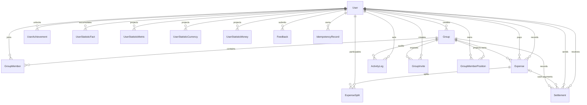

# Домен и модель данных

## Доменные агрегаты

Основной агрегат приложения — группа совместных расходов. Пользователь входит в группу через `GroupMember`, расходы принадлежат группе, а баланс группы выводится из расходов и расчётов.



`Settlement.groupId`, `ActivityLog.groupId` и все финансовые `amountBase` обязательны. Deferred constraint triggers требуют 1..100 splits и точное равенство original/base сумм splits соответствующим суммам expense к моменту commit. `ExchangeRate` является самостоятельным справочником-кэшем и не связан внешним ключом с расходом: применённый результат пересчёта фиксируется в `amountBase`.

`IdempotencyRecord` хранит scope `(principalId, operation, key)`, SHA-256 canonical request,
ID созданного ресурса и срок жизни 24 часа. Запись создаётся атомарно с group, expense,
manual settlement или feedback. Повтор с тем же payload возвращает исходный ресурс,
а повтор ключа с другим payload отклоняется. Удаление user каскадно удаляет его записи;
просроченные записи очищаются bounded batches при следующих идемпотентных командах
этого user, причём повторно используемый просроченный ключ удаляется всегда.

## Сущности

### User

Учётная запись содержит email, bcrypt hash пароля, имя, необязательный avatar URL и профильные платёжные реквизиты. Email хранится как PostgreSQL `CITEXT`, поэтому основной unique key регистронезависим и одинаково действует для Prisma и любого будущего writer.

Связи пользователя охватывают созданные группы, членства, оплаченные/созданные расходы, доли, отправленные/полученные расчёты, activity, приглашения, feedback, достижения и lifetime-факты.

### Group

Группа задаёт:

- название и описание;
- тип `HOME`, `TRIP`, `COUPLE` или `OTHER`;
- валюту расчёта;
- создателя;
- timestamps.

Текущий API позволяет выбрать тип и валюту только при создании. `updateGroupSchema` изменяет название и описание, поэтому тип и валюта расчёта после создания фактически неизменяемы.

### GroupMember

Связывает пользователя и группу. Пара `(groupId, userId)` уникальна. Повторное вступление реактивирует старую строку через `isActive`, а не создаёт новую.

Роль:

- `ADMIN` — управление группой и участниками;
- `MEMBER` — обычное участие.

Creator становится единственным admin при создании. API назначения дополнительного admin или передачи роли нет; add/reactivate/invite всегда создают `MEMBER`, а admin не может выйти самостоятельно.

В одной группе допускается не больше 100 активных участников. Ограничение повторено в HTTP validation, application transactions и deferred DB constraint.

Поля реквизитов на членстве переопределяют профильные реквизиты для конкретной группы. `null` означает наследование profile value, а не запрет раскрытия. При выходе membership row, `joinedAt` и реквизиты сохраняются. При повторном добавлении или invite role сбрасывается в `MEMBER`, но прежние реквизиты и `joinedAt` не очищаются.

### Expense

Расход содержит:

- группу;
- фактического плательщика `paidById`;
- пользователя, внёсшего запись, `createdById`;
- название, категорию, заметку и дату операции;
- сумму и валюту исходной операции;
- сумму в валюте расчёта группы;
- необязательный ручной курс;
- способ деления.

Разделение `paidById` и `createdById` важно для прав редактирования, audit trail и статистики.

### ExpenseSplit

Описывает долю одного пользователя в расходе. Пара `(expenseId, userId)` уникальна.

- `amount` — доля в валюте исходной операции;
- `amountBase` — доля в валюте расчёта группы;
- `percentage` — процент в basis points для `PERCENTAGE`.

### Settlement

Фиксирует перевод от должника `fromUserId` к получателю `toUserId`.

- Ручной расчёт имеет `expenseId = null` и создаётся в валюте расчёта группы.
- Наличный платёж «на месте» создаётся вместе с расходом и ссылается на него через `expenseId`; `amount/currency` остаются в валюте расхода, а `amountBase` — в валюте группы.
- `amountBase` участвует в расчёте баланса; для ручного расчёта он равен `amount`.

`groupId` обязателен. Только `expenseId` nullable: `null` означает ручной расчёт, значение — наличный платёж, принадлежащий тому же expense и group.

### ActivityLog

Операционный журнал группы хранит actor, тип события, логические `entityType/entityId`, JSON metadata и время. Поддерживаемые типы:

- создание, изменение и удаление расхода;
- создание или сброс расчётов;
- добавление и удаление участника;
- изменение группы.

Для перечисленных логируемых мутаций Activity создаётся в той же транзакции. Audit coverage частичное: invite create/revoke, profile/requisites, feedback, group create/delete и application-admin actions отдельными событиями не представлены; `entityType/entityId` не являются foreign keys.

### GroupInvite

Многоразовое приглашение с криптографически случайным токеном, ссылкой на группу и создателя. Отзыв выполняется флагом `revoked`; исторические строки сохраняются до удаления группы.

### ExchangeRate

Кэш «сколько RUB стоит одна единица валюты» на календарную дату. `(date,
currency)` уникальна. `rate` и `Expense.customRate` хранятся как
`NUMERIC(20,10)`, поэтому новый backend прочитает то же десятичное сохранённое
значение. Текущий TypeScript backend при вычислении преобразует rate в
JavaScript `number`, поэтому binary floating-point rounding остаётся свойством
runtime и отдельно зафиксирован golden-тестами. Денежные amounts одной операции
остаются целыми `Int`, агрегатные проекции используют `BigInt`.

### UserStatisticFact

Append/update-oriented хранилище lifetime-фактов аккаунта. Уникальный ключ `(userId, kind, reference)` делает запись идемпотентной. Факты переживают удаление исходных групп, расходов и расчётов и используются для статистики и достижений. `kind` — строковый soft dictionary, не DB enum/FK, поэтому БД способна содержать неизвестные application версии значения. Для `CURRENCY` reference равен expense ID, а код лежит в `currency`: редактирование заменяет валюту конкретной траты, удаление сохраняет её историю, а projection считает distinct currency codes.

Основные семейства фактов:

- созданные группы и прошлые вступления по типам;
- peers, расходы, участие, оплата и способы деления;
- использованные валюты и ручные курсы;
- отправленные/полученные расчёты и приглашения;
- суммы расходов/возвратов по валютам;
- исторические максимумы размера группы, числа расходов и участников.

### UserAchievement

Сохраняет уже открытое достижение отдельно от вычисляемого прогресса. `notifiedAt = null` означает, что UI ещё должен показать уведомление. Всего в текущем каталоге 49 определений, включая скрытые достижения. `achievementId` также является soft reference на code catalog, без FK; неизвестный persisted ID evaluator не сможет представить пользователю.

### Feedback

Сообщение пользователя для администратора приложения. Список доступен только application admin.

### Transactional read models

`GroupMemberPosition` хранит текущую net position пользователя в валюте расчёта
группы. `GroupMember.groupUpdatedAt` — DB-owned feed projection для индексной
пагинации групп пользователя; triggers копируют timestamp при создании
membership и после изменения группы. `UserStatisticMetric`,
`UserStatisticCurrency` и `UserStatisticMoney` компактно проецируют lifetime
facts. PostgreSQL triggers обновляют read models в той же транзакции, что source
rows; source expenses/splits/settlements и `UserStatisticFact` остаются
rebuildable source of truth. Удалённые неиспользуемые `Friendship` и
`ExpenseSplit.share` больше не являются частью схемы или миграционного контракта.

## Application invariants и DB constraints

Схема БД обеспечивает foreign keys, uniqueness, enums, каскады, row-level `CHECK` и deferred cross-row constraints. Zod/application checks нужны для понятных ошибок, а DB constraints защищают от другого backend и прямого SQL writer.

| Инвариант | Где обеспечивается |
|---|---|
| Positive expense/split/settlement amount и rate | Zod/application + DB `CHECK` |
| Формат persisted currency | Zod allowlist + DB `^[A-Z]{3}$` |
| Суммы `amount`/`amountBase` splits равны обеим суммам Expense; splits 1..100 | Application allocation + deferred DB trigger |
| Percentage sum равна 10000 basis points и хранится только для `PERCENTAGE` | Zod + deferred DB trigger |
| Payer/split/settlement users являются active members при insert/update | Service transaction + deferred DB trigger |
| Manual settlement использует group currency/base; cash settlement соответствует payer/split и не превышает долю | Service + DB checks/deferred triggers |
| Settlement не self и не превышает suggested debt | DB `CHECK` для self; debt boundary в Serializable transaction |
| Member removal только при нулевом raw balance | Service/Serializable transaction + deferred position trigger |
| Group delete только admin и при всех нулевых raw balances | Service/Serializable transaction |
| Creator остаётся active admin; active members ≤ 100 | Application + deferred DB trigger |
| Group creator/currency, expense group/creator и cash monetary facts не repoint-ятся | DB immutable-identity triggers |
| Settlement expense относится к той же группе; financial membership history не удаляется | Deferred DB triggers |

Cross-row constraints берут per-group advisory transaction lock, поэтому
параллельные direct writers с `READ COMMITTED` не подтверждают один инвариант по
двум stale snapshots. Group-scoped application mutations берут этот lock до
первой row write, чтобы PostgreSQL row locks и deferred triggers всегда шли в
одном порядке; распознанные serialization/deadlock conflicts ограниченно
повторяются. Правила, зависящие от текущего suggested debt, permissions
и происхождения currency conversion, остаются application-level: БД не может
сама доказать, каким quote/custom rate был получен `amountBase`.

## Денежная модель

### Минимальные единицы

Все суммы хранятся как целые числа в единой внутренней шкале 1/100 отображаемой денежной единицы. UI безусловно умножает ввод на 100 и делит вывод на 100. Для валют без официальной сотой доли, например JPY, это условная прикладная шкала, а не ISO 4217 minor unit.

Предел transport-валидации для расхода — `2_000_000_000`, дополнительная проверка перед БД ограничивает пересчитанное значение диапазоном PostgreSQL `INTEGER` (`2_147_483_647`).

### Две валютные координаты

```text
Expense.amount / ExpenseSplit.amount
    исходная валюта конкретной траты

Expense.amountBase / ExpenseSplit.amountBase
    валюта расчёта группы на дату траты
```

Если валюты совпадают, factor равен 1. Иначе используется ручной `customRate` либо кросс-курс через RUB:

```text
factor(from -> groupCurrency) = rateToRub(from) / rateToRub(groupCurrency)
amountBase = round(amount * factor)
```

Expense total округляется один раз. Для splits применяется largest-remainder allocation со стабильным tie-break по исходному порядку участников, поэтому `sum(ExpenseSplit.amountBase) = Expense.amountBase`. Если positive total или split округлился бы до нуля, запись отклоняется.

Поддерживаются 20 валют: RUB, USD, EUR, AMD, GEL, TRY, THB, AED, GBP, JPY, CNY, CHF, CZK, PLN, HUF, KZT, UZS, BYN, AZN и INR.

### Деление расхода

| Режим | Правило |
|---|---|
| `EQUAL` | Целочисленное деление; остаток добавляется первому участнику |
| `EXACT` | Каждая доля задана явно; сумма долей должна совпадать с расходом |
| `PERCENTAGE` | Проценты задаются basis points и в сумме равны `10000`; округлённый остаток получает первый участник |

Boundary-валидация запрещает пустой список, дубли пользователей, неположительные exact/percentage значения и неверную сумму. Сервис дополнительно проверяет активное членство плательщика, всех участников и участников наличных платежей.

Для `EQUAL`/`PERCENTAGE` операция отклоняется, если positive доля после FX не
представима хотя бы одной minor unit group currency. Плательщик обязан быть
active member, но не обязан входить в splits; в таком случае он кредитует все
перечисленные доли.

### Наличные платежи при создании расхода

Наличный платёж моделируется как обычный `Settlement`, созданный атомарно вместе с `Expense`:

```text
cash participant -> expense payer
```

Платёж запрещён для самого плательщика, не может дублироваться и превышать долю
участника. При изменении расхода денежный факт наличного расчёта сохраняется:
его `amount`, `currency` и `amountBase` не пересчитываются. Обновляются только
получатель (`toUserId`, если изменился плательщик расхода), календарная дата и
notes. При удалении расхода связанные расчёты удаляются каскадно.

В cash-settlement activity поле `actorId` указывает authenticated автора записи расхода, а не обязательно пользователя `fromUserId`, передавшего наличные; последний представлен в metadata.

## Расчёт баланса

Source ledger остаётся нормализованным, но текущий баланс хранится также в транзакционной проекции `group_member_positions`.

1. Для каждого расхода плательщику добавляются доли остальных участников, участникам — вычитаются их доли.
2. Для каждого расчёта отправителю сумма добавляется, получателю — вычитается.
3. Положительные net positions становятся кредиторами, отрицательные — должниками.
4. Два отсортированных списка жадно сопоставляются до погашения всех позиций.

Триггеры применяют к проекции signed delta каждой вставки/правки/удаления expense, split и settlement. Чтение группы поэтому имеет стоимость `O(число участников)`, а не `O(вся финансовая история)`. Затем чистая функция `calculateSimplifiedDebtsFromBalances` выполняет детерминированную greedy-схему `O(n log n)`; при равных суммах tie-break идёт по immutable user ID.

`rebuild_group_member_positions()` атомарно пересобирает positions из source
ledger под table locks. Аналогичная `rebuild_user_statistic_projections()`
восстанавливает три статистические проекции из lifetime facts; обе вызываются
операционной командой `npm run db:rebuild-projections`.

Проекция использует обязательный `amountBase`; nullable fallback удалён из модели и API.

Для имён ledger загружает все membership rows, включая inactive. Поэтому balance response может содержать бывшего участника, которого уже нет в active `group.members` projection.

## Текущая и lifetime-история

В системе существуют три разных представления прошлого:

| Представление | Назначение | Поведение при удалении группы/расхода |
|---|---|---|
| Доменные строки | Текущий баланс и текущий UI | Удаляются по cascade rules |
| `ActivityLog` | Операционная история конкретной группы | Удаляется вместе с группой |
| `UserStatisticFact`, его projections и `UserAchievement` | История аккаунта и уже полученные награды | Сохраняются до удаления пользователя |

При редактировании расхода изменяемые факты пересобираются, денежный и валютные
факты следуют за актуальными плательщиком/суммой/валютой, а исторические
рекорды-максимумы не уменьшаются. Тип `OTHER` хранится и проецируется отдельно,
а не выводится из максимума одновременно активных групп. Baseline предназначена
только для новой пустой БД и не содержит upgrade/backfill предыдущих схем.

Money statistics являются gross totals: `MONEY_SPENT` — полная original amount расходов, где user был payer, а `MONEY_RETURNED` — amount полученных settlements. Это не личная доля, net balance или единая базовая валюта; manual return учитывается в group currency, cash return — в expense currency.

## Referential actions и индексы

Каскадно удаляются:

- членства, расходы, расчёты, activity и приглашения вместе с группой;
- splits и cash settlements вместе с расходом;
- achievements и statistic facts вместе с пользователем.

Большинство бизнес-ссылок на пользователя используют `RESTRICT`, чтобы пользователь не мог исчезнуть из финансовой истории неявно.

Ключевые индексы поддерживают:

- cursor-ленту групп по membership projection
  `(userId, isActive, groupUpdatedAt DESC, groupId DESC)`;
- cursor-ленты расходов и расчётов `(groupId, date DESC, createdAt DESC, id DESC)`;
- activity `(groupId, createdAt DESC, id DESC)` и feedback `(createdAt DESC, id DESC)`;
- fallback курса `(currency, date DESC)`;
- lookup source facts `(reference, kind)` и compact projections по primary key;
- trigram-поиск пользователей по имени и partial unique active invite.

Строгие left-prefix дубликаты unique indexes удалены, чтобы не платить лишней write amplification. Схема, имена критичных индексов, типы колонок и триггеры зафиксированы отдельным DB architecture contract test.
