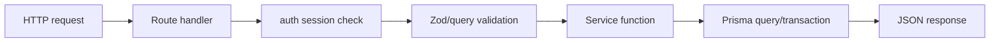
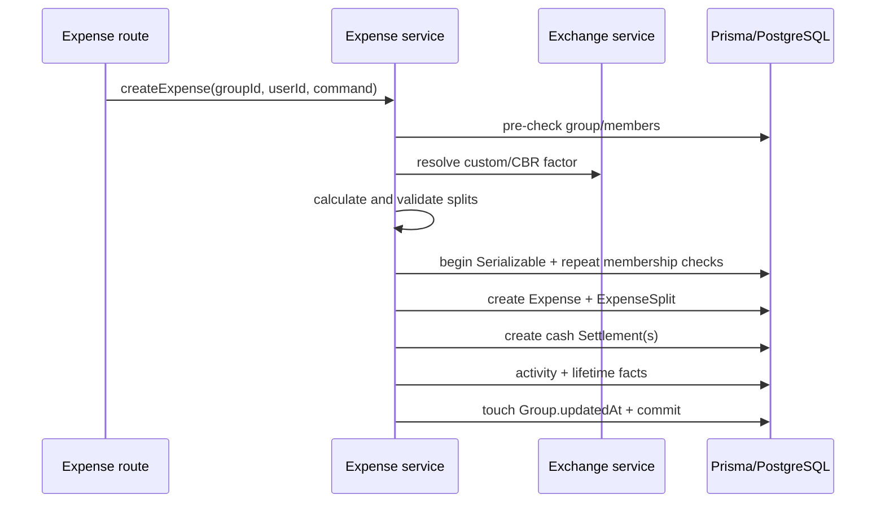

# Backend и HTTP API

## Размещение backend

Backend встроен в Next.js App Router и работает в том же Node.js процессе, что server rendering и раздача frontend.

```text
src/app/api/**/route.ts       transport / HTTP boundary
src/services/*.service.ts    application and domain orchestration
src/lib/validations/*.ts     transport validation
src/lib/utils/*.ts           pure domain calculations
src/lib/auth*.ts             authentication/session
src/lib/db.ts                Prisma Client singleton
prisma/schema.prisma         persistence model
```

Отдельных repository interfaces и разделённых domain/persistence models нет. Services и некоторые routes всё ещё получают Prisma-shaped results, но публичные success responses проходят через явные v1 response DTO и field-by-field mapper-ы. Большая часть use-case логики находится в services, однако profile, registration, user search, activity и group requisites routes используют Prisma напрямую.

## Стандартный request flow



Типичная critical core-мутация:

1. `auth()` возвращает session с `user.id` и role;
2. route безопасно разбирает JSON;
3. Zod schema валидирует transport input;
4. route передаёт authenticated `userId` отдельным аргументом;
5. service проверяет group membership/role и доменные инварианты;
6. критический service повторяет проверки внутри transaction;
7. предусмотренные сценарием activity и/или lifetime facts фиксируются атомарно;
8. известная `Error("CODE")` преобразуется в HTTP status/message.

Не все read routes обёрнуты в `try/catch`; неожиданные Prisma ошибки в них обрабатывает стандартный error handling Next.js.

## Endpoint inventory

Всего реализовано 23 пути `/api/v1` и 33 v1 HTTP-операции, а также Auth.js catch-all route.

Машиночитаемый canonical contract находится в
`contracts/openapi/v1.openapi.json`. Он описывает текущие DTO, cookie auth, page
pagination, integer money и неоднородные error envelopes. Контракт и реализация
меняются вместе; при переписывании неудачную семантику v1 можно исправлять
явными согласованными изменениями контракта. Тест
`contracts/openapi/v1.openapi.test.ts` сверяет множество path/method с
фактическими route handlers и проверяет operation IDs, responses и локальные
OpenAPI references. `src/app/api/v1/api-routes.contract.test.ts` напрямую
вызывает handlers и фиксирует status/JSON для всех операций. Отдельные
field-by-field response mapper-ы не позволяют новым Prisma-полям автоматически
становиться частью API.

### Auth.js

| Метод и путь | Доступ | Назначение |
|---|---|---|
| `GET/POST /api/auth/[...nextauth]` | Auth.js protocol | Credentials sign-in, session, sign-out и внутренние auth actions |

### Authentication boundary

| Метод и путь | Доступ | Назначение |
|---|---|---|
| `POST /api/v1/auth/credentials` | Public | Проверить credentials и вернуть стабильные identity claims для Auth.js без persistence-модели |

### Users

| Метод и путь | Доступ | Назначение |
|---|---|---|
| `POST /api/v1/users/register` | Public | Создать user и вернуть public projection |
| `GET /api/v1/users/search?q=` | Session | Поиск других users по имени, минимум два символа, максимум 10 |
| `GET /api/v1/users/me` | Session | Профиль текущего user |
| `PATCH /api/v1/users/me` | Session | Имя, avatar и профильные реквизиты |
| `GET /api/v1/users/me/statistics` | Session | Lifetime statistics и money totals по валютам |
| `GET /api/v1/users/me/achievements` | Session | Прогресс и persisted achievements без записи в БД |
| `POST /api/v1/users/me/achievements/unseen` | Session | Синхронизировать, атомарно забрать и пометить показанными новые достижения |

Achievement GET является safe read. Persistence и notification claim выполняет явный POST.

### Groups

| Метод и путь | Доступ | Назначение |
|---|---|---|
| `GET /api/v1/groups` | Session | Активные группы пользователя |
| `POST /api/v1/groups` | Session | Создать группу; creator становится admin |
| `GET /api/v1/groups/:id` | Active member | Группа, участники, условно видимые реквизиты |
| `PATCH /api/v1/groups/:id` | Group admin | Изменить name/description |
| `DELETE /api/v1/groups/:id` | Group admin | Удалить группу при нулевых raw balances |
| `GET /api/v1/groups/:id/activity` | Active member | Последние 50 событий |
| `POST /api/v1/groups/:id/members` | Group admin | Добавить/reactivate участника |
| `DELETE /api/v1/groups/:id/members?userId=` | Self либо group admin | Выйти или деактивировать участника |
| `PATCH /api/v1/groups/:id/requisites` | Active member | Изменить собственные group overrides |
| `POST /api/v1/groups/:id/invite` | Active member | Получить существующий или создать active invite |
| `DELETE /api/v1/groups/:id/invite` | Group admin | Отозвать все active invites |

### Expenses, balances и settlements

| Метод и путь | Доступ | Назначение |
|---|---|---|
| `GET /api/v1/groups/:id/expenses?page=N` | Active member | Страница из 30 расходов |
| `POST /api/v1/groups/:id/expenses` | Active member | Создать расход |
| `GET /api/v1/expenses/:id` | Active member | Получить расход |
| `PATCH /api/v1/expenses/:id` | Creator, payer либо admin | Гибридный update обязательных полей и splits; см. lifecycle ниже |
| `DELETE /api/v1/expenses/:id` | Creator либо admin | Удалить расход |
| `GET /api/v1/groups/:id/balances` | Active member | Raw и simplified balances |
| `GET /api/v1/balances/overview` | Session | Балансы по контрагенту и валюте групп |
| `POST /api/v1/settlements` | Debtor/active member | Частично или полностью погасить свой suggested debt |
| `GET /api/v1/groups/:id/settlements` | Active member | Все расчёты группы |
| `DELETE /api/v1/groups/:id/settlements` | Group admin | Удалить только manual settlements |

### Invites и feedback

| Метод и путь | Доступ | Назначение |
|---|---|---|
| `GET /api/v1/invites/:token` | Session | Информация о действующем invite |
| `POST /api/v1/invites/:token/accept` | Session | Вступить/reactivate membership |
| `POST /api/v1/feedback` | Session | Отправить feedback |
| `GET /api/v1/admin/feedback` | Application admin | Последние 100 сообщений с user name/email |

## Boundary validation

### Расход

`createExpenseSchema` проверяет:

- title длиной 1..255;
- positive integer amount до 2 млрд;
- currency из 20 поддерживаемых кодов;
- positive custom rate до 1 млн;
- строгую календарную дату `YYYY-MM-DD`; timestamp отклоняется, а дата сохраняется как UTC midnight;
- непустой и уникальный список split users;
- optional notes длиной до 1000 и optional category без отдельного ограничения длины;
- exact shares > 0 и точное совпадение суммы;
- percentage shares > 0 и сумму `10000` basis points;
- уникальные positive cash payments только для участников, не для payer и не выше доли.

Та же schema используется для `PATCH`: обязательные поля и splits заменяются полностью, отсутствующий `customRate` сбрасывается в null, а отсутствующие `notes/category` попадают в Prisma как `undefined` и сохраняют прежнее значение. Cash payments на update запрещены. Это гибридная, не полностью REST-типичная PATCH semantics.

### Группа

- name 1..100;
- description до 500;
- type из четырёх enum values;
- supported settlement currency;
- список непустых member IDs.

Update schema содержит только optional name/description. Пустой object проходит validation и всё равно приводит к update/activity.

### Расчёт

- непустые group/recipient IDs;
- positive integer amount до 2 млрд;
- строгую календарную дату `YYYY-MM-DD`; timestamp отклоняется;
- notes до 500;
- transport currency длиной три символа.

Входной `currency` сервис не использует: authoritative currency берётся из группы.

### Профиль и feedback

Profile fields нормализуют реквизиты через `trim`; пустая строка превращается в null. Avatar принимает только `http/https` URL. Feedback ограничен 10..2000 символами. Registration требует валидный email, name 1..100 и password минимум восемь символов, но не больше 72 UTF-8 байт.

Общие ограничения schemas:

- whitespace-only name/title может пройти `min(1)` там, где нет transform/trim;
- array size limits для splits, members и cash payments отсутствуют;
- будущие календарные даты не запрещены;
- лишние JSON fields Zod по умолчанию отбрасывает;
- часть query parameters проверяется вручную и возвращает другой error shape.

## Сервисы

| Service | Ответственность |
|---|---|
| `groups.service.ts` | Группы, membership, роли, privacy реквизитов, условия удаления |
| `expenses.service.ts` | CRUD расходов, split rows, FX, cash settlements, audit/history |
| `balances.service.ts` | Загрузка ledger, group debt и overview aggregation |
| `settlements.service.ts` | Погашение долга, reset, история расчётов |
| `invites.service.ts` | Создание, отзыв, чтение и принятие invite |
| `exchange.service.ts` | Курсы ЦБ, DB cache, fallback и конвертация |
| `statistics-history.service.ts` | Атомарная запись lifetime-фактов |
| `statistics.service.ts` | Current/historical metrics и money totals |
| `achievements.service.ts` | Оценка, сохранение и notification lifecycle достижений |
| `feedback.service.ts` | Создание и admin listing feedback |

## Жизненный цикл расхода

### Create



Любой active member может создать запись, указав любого active member плательщиком. `createdById` фиксирует автора и позже не изменяется.

После создания cash settlements сервис перечитывает полный агрегат. Поэтому
первый успешный create response уже содержит созданные наличные расчёты.

### Update

Редактировать может creator, payer или admin. Splits полностью удаляются и
создаются заново. Новые cash payments через update запрещены; уже существующие
сохраняют фактические `amount/currency/amountBase`, но получают актуальные
`toUserId`, date и notes. Update отклоняется, если ранее принятая наличная сумма
в валюте расчёта стала больше новой доли участника.

После финансовой части update проверяется, что ни у одного inactive member не появился raw balance; нарушение откатывает всю Serializable transaction.

### Delete

Удалить может creator или admin. До удаления создаётся audit event; expense splits и связанные cash settlements удаляются каскадно. Lifetime facts сохраняются.

## Балансы и settlements

`computeGroupDebts` параллельно читает все расходы со splits, все settlements и всех участников группы. Затем чистая функция строит raw positions и greedy simplified graph.

Manual settlement разрешён только если в текущем simplified graph существует прямое ребро:

```text
session user -> selected recipient
```

Сумма может быть меньше suggested debt, но не больше. Проверка долга выполняется повторно внутри Serializable transaction и предотвращает два одновременно успешных превышающих платежа. Конфликт `P2034` автоматически повторяется до трёх раз с exponential backoff и jitter; исчерпанный retry превращается в контролируемый HTTP 409.

Reset удаляет только строки `expenseId IS NULL`. Cash settlements считаются частью расходов и остаются.

## Группы и membership

Membership использует soft state `isActive`.

- create group дедуплицирует member IDs и делает creator admin;
- creator может сразу активировать memberships выбранных users, а admin — добавить зарегистрированного user без его acceptance; invite является альтернативным consent flow;
- add/reactivate всегда назначает `MEMBER` для старой строки;
- inactive member не имеет доступа;
- admin не может выйти сам;
- другого участника можно удалить только при его нулевом raw balance;
- группу можно удалить только при нулевых raw balances всех участников.

`getGroup` возвращает реквизиты только самого пользователя и текущих creditors, которым он должен по simplified graph. У остальных пользователей обнуляются и membership overrides, и profile defaults.

## Приглашения

Любой active member может получить active invite; отзывать может только admin. Токен — UUID без дефисов, TTL и лимита использований нет. Sequential acceptance идемпотентен для уже active member и реактивирует inactive member как `MEMBER`. Выход создателя invite не отзывает токен автоматически.

DB constraint «не более одного active invite на группу» отсутствует. Инвариант
сейчас обеспечивается Serializable create/revoke/accept transactions с bounded
retry: concurrent get-or-create возвращает один active invite, а гонка accept с
revoke завершается согласованным отозванным состоянием.

## Activity и lifetime statistics

Activity охватывает expense CRUD, settlement create/reset, member add/remove и group update. Group create/delete, invite create/revoke, profile/requisites и feedback отдельными activity types не логируются. Lifetime facts имеют другое покрытие: reset/delete/remove/revoke/group update не создают новые факты, а уже накопленная история намеренно сохраняется.

`entityType/entityId` являются логическими ссылками без foreign key. Поэтому событие удаления/изменения операции остаётся в журнале до удаления группы.

Lifetime facts пишутся внутри тех же transactions, что group/expense/settlement/invite use cases. Statistics endpoint читает historical facts; achievements объединяют current metrics, historical maxima и persisted unlocks.

Achievement GET только вычисляет progress. POST unseen сохраняет новые unlocks и атомарно забирает уведомления через conditional `UPDATE ... RETURNING`, поэтому два клиента не получают одну строку одновременно.

## Транзакции и concurrency

| Операция | Isolation |
|---|---|
| Expense create/update/delete | Serializable |
| Manual settlement create | Serializable |
| Group delete | Serializable |
| Member add/remove | Serializable |
| Group create/update | Default PostgreSQL isolation |
| Invite create/revoke/accept | Serializable |
| Settlement reset | Serializable |

Все перечисленные Serializable operations используют общий bounded retry для
Prisma `P2034`. Внутритранзакционные rechecks защищают membership, edit
permissions, debt amount, admin role, zero-balance deletion, invite state и
settlement reset. Реальные E2E/DB race-сценарии фиксируют согласованное конечное
состояние для invite create/revoke/accept, member add/remove, expense против
member removal и settlement create/reset. Основные незакрытые concurrency cases:

- POST operations не используют idempotency key, поэтому network retry способен продублировать group, expense, settlement или feedback;
- FX lookup выполняется до финансовой transaction.

## Ошибки

`handleServiceError` сопоставляет строковый `Error.message` с HTTP статусом:

- 403 — insufficient permissions;
- 404 — отсутствующая сущность или invite;
- 409 — состояние группы/участника конфликтует с операцией;
- 422 — нарушен бизнес-инвариант;
- 503 — курс недоступен;
- 500 — всё неизвестное.

Исключение — `POST /users/me/achievements/unseen`: route ловит любую ошибку и отвечает HTTP 200 `{ unlocked: [] }`, поэтому инфраструктурный сбой неотличим от отсутствия новых достижений.

Форматы ответа неодинаковы:

```text
{ error: "Unauthorized" }
{ error: "Not found" }
{ error: { formErrors, fieldErrors } }
{ error: { code, message } }
{ error: { message } }
```

Строковые domain codes не типизированы. `handleServiceError` превращает unknown exception в generic 500 без contextual logging; Prisma error log и стандартный Next.js logger могут отдельно зафиксировать часть инфраструктурных/неперехваченных ошибок.

## Производительность

- group balance каждый раз читает полную историю расходов/splits/settlements;
- group details дополнительно строит весь debt graph ради privacy реквизитов;
- overview eager-load-ит полную историю всех active groups пользователя;
- settlements не пагинируются;
- activity ограничена последними 50 без continuation;
- feedback ограничен 100 без continuation;
- expense list использует offset pagination, page 1..100000, по 30 строк;
- statistics/achievements выполняют наборы параллельных запросов без application cache;
- cash settlements и некоторые statistic facts записываются последовательно внутри transaction;
- request body size и domain array size отдельно не ограничены.

При равных net balances порядок greedy counterparty может зависеть от порядка строк из БД, поскольку ledger queries не имеют стабильного `orderBy`. Raw balances остаются теми же, но simplified edge может измениться.
