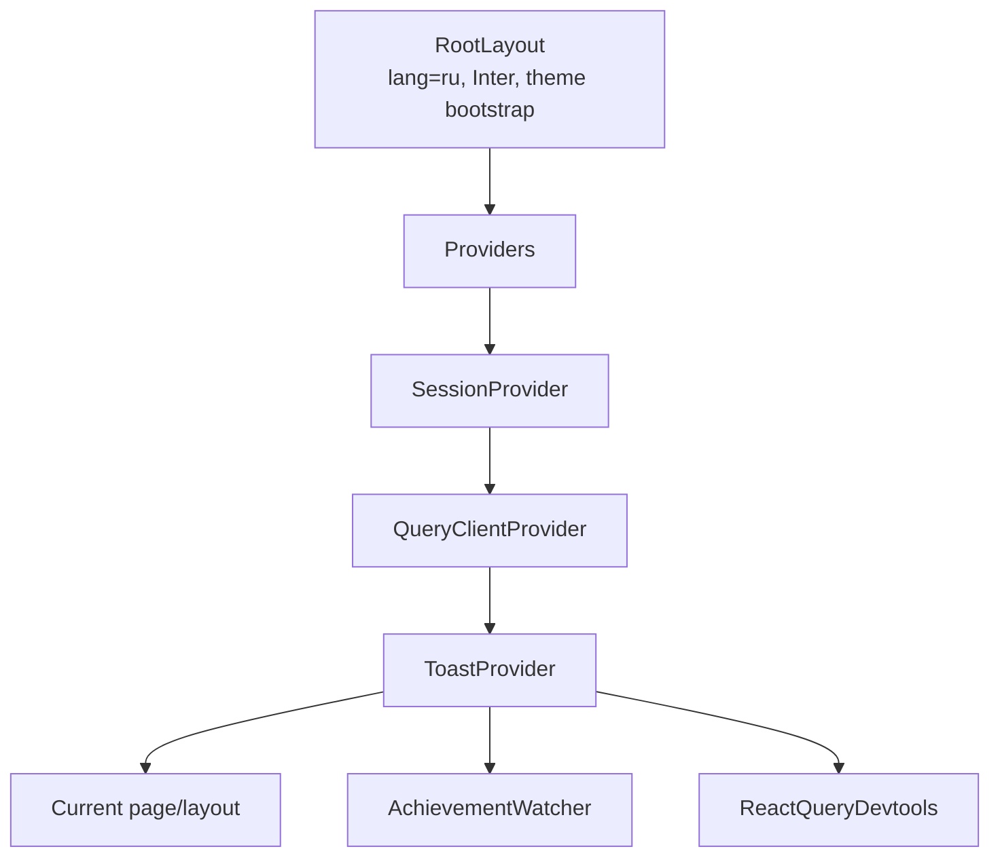
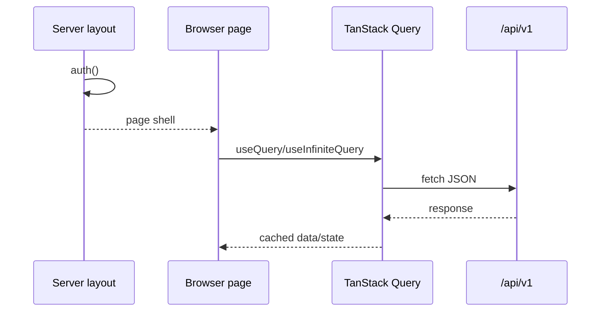

# Frontend

## Технологическая модель

Frontend построен на Next.js 15 App Router и React 19. Прикладные экраны в основном являются client components, а server components используются для корневой композиции, проверки сессии и статического публичного содержимого.

Основные зависимости:

- TanStack Query — server state и мутации;
- Auth.js `SessionProvider` — клиентское состояние сессии;
- Tailwind CSS — layout и дизайн-токены;
- Radix UI — доступные dialog/select/popover primitives;
- React Hook Form — только форма feedback;
- Zod — shared validation schemas;
- Lucide — иконки.

Zustand находится в dependencies, но текущий UI его не использует. Глобального client store нет; локальное состояние хранится в `useState`, производное — в `useMemo`.

## Дерево композиции

`Providers` создаёт один `QueryClient` на lifetime смонтированного root provider tree; reload/remount создаёт новый. Query по умолчанию имеет `staleTime = 60 секунд` и один retry, а invite query явно задаёт `retry: false`. Persistence, offline queue, server prefetch/dehydrate и общие mutation defaults отсутствуют.

React Query Devtools подключён в общем provider tree. Production-поведение панели полагается на внутренний production guard пакета.

## Маршрутизация

Route groups в скобках организуют layouts и не входят в URL.

| URL | Исходник | Граница/назначение |
|---|---|---|
| `/` | `src/app/page.tsx` | Публичный server-rendered landing; вошедший пользователь перенаправляется в dashboard |
| `/login` | `src/app/(auth)/login/page.tsx` | Credentials login |
| `/register` | `src/app/(auth)/register/page.tsx` | Регистрация и автоматический login |
| `/faq` | `src/app/faq/page.tsx` | Публичный FAQ или FAQ внутри dashboard shell для вошедшего пользователя |
| `/invite/[token]` | `src/app/invite/[token]/page.tsx` | Просмотр и принятие приглашения |
| `/dashboard` | `src/app/(dashboard)/dashboard/page.tsx` | Итоговые балансы и группы |
| `/groups` | `src/app/(dashboard)/groups/page.tsx` | Список активных групп |
| `/groups/new` | `src/app/(dashboard)/groups/new/page.tsx` | Создание группы и предварительное добавление пользователей |
| `/groups/[id]` | `src/app/(dashboard)/groups/[id]/page.tsx` | Основной workspace группы |
| `/groups/[id]/settings` | `src/app/(dashboard)/groups/[id]/settings/page.tsx` | Участники, реквизиты, invite, rename/leave/delete |
| `/activity` | `src/app/(dashboard)/activity/page.tsx` | Сводная активность по группам |
| `/profile` | `src/app/(dashboard)/profile/page.tsx` | Профиль, статистика, достижения и logout |
| `/feedback` | `src/app/(dashboard)/feedback/page.tsx` | Отправка обратной связи |
| `/admin/feedback` | `src/app/(admin)/admin/feedback/page.tsx` | Application-admin список feedback |

Специализированных `loading.tsx`, `error.tsx` и `not-found.tsx` нет. Состояния загрузки и ошибок обрабатываются локально в компонентах.

## Layout-ы и границы доступа

### Root layout

`src/app/layout.tsx` задаёт русский язык документа, metadata, Inter с latin/cyrillic subset и все глобальные providers. Inline script до hydration восстанавливает `dark` class из `localStorage` или system preference и уменьшает flash неправильной темы.

### Auth layout

`src/app/(auth)/layout.tsx` server-side проверяет сессию. Уже вошедший пользователь не видит login/register и перенаправляется на `/`.

### Dashboard layout

`src/app/(dashboard)/layout.tsx` выполняет authoritative `auth()` check и оборачивает страницу в `DashboardShell`. Shell содержит desktop sidebar, mobile bottom navigation и прокручиваемый main region.

### Admin layout

`src/app/(admin)/layout.tsx` отдельно проверяет сессию и `session.user.role === 'ADMIN'`. Это UI boundary; admin API повторяет проверку независимо.

### Middleware

`src/middleware.ts` смотрит только на наличие session cookie и делает ранний UX redirect. Он не валидирует JWT и не является security boundary. Middleware не авторизует API: защищённые v1 routes проверяют session сами, registration остаётся публичным, а `/api/auth` обслуживает Auth.js.

## Получение данных

Прикладные API-данные не prefetch-ятся server-side и не гидратируются в Query cache. Server components при этом выполняют `auth()` и выбирают layout. После прохождения server layout guard client page делает собственные HTTP-запросы к same-origin `/api/v1`.

Отдельного API client, query-key factory, generated DTO и общего error decoder нет. Fetch functions и response types обычно располагаются внутри page/component; `src/types/index.ts` используется ограниченно.

JSON responses не проходят runtime schema validation: TypeScript casts/generics не защищают от изменившегося Prisma-derived response shape.

`SessionProvider` не получает session, уже прочитанную server layout-ом. Поэтому browser отдельно загружает client session; имя пользователя и admin navigation могут появиться после первоначального shell render.

## Query cache

| Query key | Источник | Основной потребитель |
|---|---|---|
| `['overview']` | `GET /balances/overview` | Dashboard |
| `['groups']` | `GET /groups` | Dashboard и список групп |
| `['group', groupId]` | `GET /groups/:id` | Group workspace/settings |
| `['expenses', groupId]` | `GET /groups/:id/expenses?page=N` | Infinite query расходов |
| `['balances', groupId]` | `GET /groups/:id/balances` | Workspace группы |
| `['activity']` | `GET /groups`, затем fan-out по `/groups/:id/activity` | Общая лента активности |
| `['profile']` | `GET /users/me` | Профиль |
| `['statistics']` | `GET /users/me/statistics` | Статистика профиля |
| `['achievements']` | `GET /users/me/achievements` | Достижения |
| `['invite', token]` | `GET /invites/:token` | Страница приглашения |
| `['admin', 'feedback']` | `GET /admin/feedback` | Admin page |

Expense list использует page-based `useInfiniteQuery`. Сервер возвращает по 30 строк, а UI загружает следующую страницу по кнопке. Фильтрация расходов по участнику, remembered manual rate и recent currencies вычисляются только по уже загруженным страницам.

## Мутации и инвалидация

Optimistic updates не используются. Для перечисленных мутаций компоненты вручную инвалидируют указанные keys; совпавшие active queries TanStack Query перечитывает. Глобальной invalidation policy нет.

| Сценарий | Инвалидируемые ключи |
|---|---|
| Создание/изменение/удаление расхода | expenses группы, balances группы, overview |
| Создание расчёта | balances группы, overview |
| Сброс расчётов | balances группы, overview |
| Rename/member/requisites в settings | group, groups, balances |
| Создание группы | groups |
| Выход/удаление группы | groups |
| Изменение профиля | profile и широкие prefixes group/groups/expenses/balances, overview, achievements, statistics |
| Requisites nudge | profile + group либо только group |
| Новое достижение | achievements |
| Принятие invite | Явной invalidation нет; выполняется переход в новую группу |

Фактические пробелы cache coherence:

- activity не инвалидируется после доменных мутаций;
- statistics обычно не инвалидируется после действий, меняющих lifetime-факты;
- groups не инвалидируется после расхода, хотя меняются `updatedAt` и expense count;
- groups также не инвалидируется после settlement/reset (`updatedAt`) и принятия invite;
- rename группы не инвалидирует overview, где отображаются имена групп;
- debt-changing expense/settlement/reset не инвалидируют group projection с условно видимыми реквизитами;
- leave/delete инвалидирует groups, но оставляет cached group/expenses/balances/activity удалённой группы;
- QueryClient явно не очищается при смене identity и полагается на полную навигацию Auth.js.

## Глобальные UI-механизмы

### Toasts

`ToastProvider` — собственный контекст и stack уведомлений. Обычный toast живёт четыре секунды, achievement toast — шесть. Стек закреплён в правом нижнем углу.

### Achievement watcher

`AchievementWatcher` подписывается на global MutationCache. При установлении authenticated session state и после каждой успешной TanStack mutation он с debounce 500 мс вызывает явный POST unseen achievements. Полученные награды показывает с интервалом 900 мс и инвалидирует achievement query. Ошибка этого вспомогательного потока сознательно подавляется.

### Theme

`src/hooks/use-theme.ts` переключает `light/dark`, изменяет class корневого элемента и `localStorage`. Автоматического отслеживания последующих изменений system preference или storage events нет. Sidebar и MobileNav смонтированы одновременно и имеют независимое theme state, поэтому после toggle и смены breakpoint скрытый control может показывать устаревшее состояние. Auth/invite backgrounds используют светлые gradients без dark variants.

## Формы и client validation

Только feedback системно использует React Hook Form с `zodResolver` и shared schema. Login/register и доменные формы построены на controlled `useState`, локальных checks/parsers и окончательной server validation.

- Expense form переводит decimal input в integer scale через `parseMoneyInput` и отдельно обрабатывает `RATE_UNAVAILABLE`.
- Settlement/group/profile/settings имеют собственные способы декодирования ошибок.
- User search в new group/settings запускается от двух символов без debounce, cancellation и защиты от out-of-order responses.
- В new-group форме состояние `searching` вычисляется, но не визуализируется.

## Компонентные слои

### Layout

- `DashboardShell`;
- `Sidebar`;
- `MobileNav`;
- `PublicHeader`.

### Feature components

- `ExpenseForm` — создание/изменение расхода, split modes, курсы и наличные;
- `SettlementForm` — фиксация долга и отображение реквизитов;
- `StatisticsSection` и `AchievementsSection`;
- `RequisitesNudgeDialog`;
- `AchievementWatcher`;
- `FaqContent`.

### UI primitives

В `src/components/ui` находятся button, card, input, textarea, label, select, dialog, badge, avatar, skeleton, separator, currency select, theme toggle и toast. Variants кнопки построены через CVA, conditional classes — через `cn`.

Основные hotspots связанности:

- group page — около 698 строк;
- group settings page — около 446 строк;
- expense form — около 414 строк.

Эти файлы одновременно содержат HTTP orchestration, локальные DTO, permission-derived UI, финансовое view state, диалоги и разметку.

## Пользовательские сценарии

### Регистрация и вход

Регистрация создаёт пользователя через API и затем выполняет credentials sign-in. Login передаёт Credentials provider email/password и после успеха переходит на callback или корневой URL. Root page отправляет вошедшего пользователя на dashboard.

### Создание группы

Пользователь задаёт имя, тип, валюту расчёта и может найти зарегистрированных людей по имени. Backend всегда добавляет creator как admin. После создания UI инвалидирует список групп и открывает workspace.

### Приглашение

Участник получает многоразовую ссылку из settings, admin может её отозвать. Неавторизованный получатель сначала проходит login, затем API проверяет токен и добавляет его в группу как `MEMBER`.

### Расход

Форма по умолчанию выбирает текущего пользователя плательщиком, всех участников, валюту группы, текущую дату и `EQUAL`. Дополнительно доступны subset участников, `EXACT`, `PERCENTAGE`, иностранная валюта, ручной курс, заметка и наличные платежи. При `RATE_UNAVAILABLE` форма переводит ручной курс в обязательное состояние.

### Баланс и расчёт

Workspace показывает упрощённые долги. Кнопка оплаты доступна текущему пользователю только на его исходящем долге. Settlement form предлагает сумму долга, реквизиты получателя, дату и заметку; частичная оплата разрешена.

### Settings

В settings admin может изменить название, добавить/удалить участников, отозвать invite и удалить группу. Обычный участник может выйти. Любой участник может получить active invite и изменить собственные group-specific реквизиты. Кнопка admin reset manual settlements находится в основном workspace группы, не в settings.

### Профиль и история

Профиль объединяет lifetime statistics, список достижений, имя и реквизиты. Activity page сначала получает группы, затем параллельно загружает журнал каждой группы и объединяет его на клиенте.

## Responsive и accessibility

На `md+` используется sidebar шириной 16rem, на мобильных — fixed bottom navigation и дополнительный нижний padding контента. Expense create/edit dialogs ограничены по высоте и прокручиваются; остальные dialogs полагаются на базовый `DialogContent`. Content grids переключаются на `sm/lg` breakpoints.

Radix primitives дают базовую keyboard/focus semantics для dialog/select/popover. Известные пробелы:

- часть фильтров реализована clickable `div` без keyboard role;
- custom participant toggles не всегда имеют `aria-pressed`/checkbox semantics;
- не у всех icon-only controls есть `aria-label`;
- toast stack не объявлен через `aria-live`;
- skip link отсутствует;
- toast и mobile navigation могут пересекаться на узком viewport.

## Ошибочные состояния UI

Обработка ошибок неоднородна. Invite, achievements и statistics имеют явные error states, но часть экранов интерпретирует failed query как отсутствие данных:

- расходы могут выглядеть как пустой список;
- failed balance — как полностью закрытые долги;
- failed group query — как отсутствующая группа;
- failed dashboard overview — как «Все расчёты завершены», а groups error — как пустой блок;
- `/groups` error — как пустой список;
- failed admin feedback GET — как отсутствие сообщений;
- activity подавляет ошибки отдельных групп.
- top-level failure загрузки списка групп также выглядит как пустая activity;
- profile error оставляет пустую редактируемую форму;
- централизованной реакции на 401 после истечения client session нет.

Единого декодера HTTP ошибок и общего retry UI нет.
