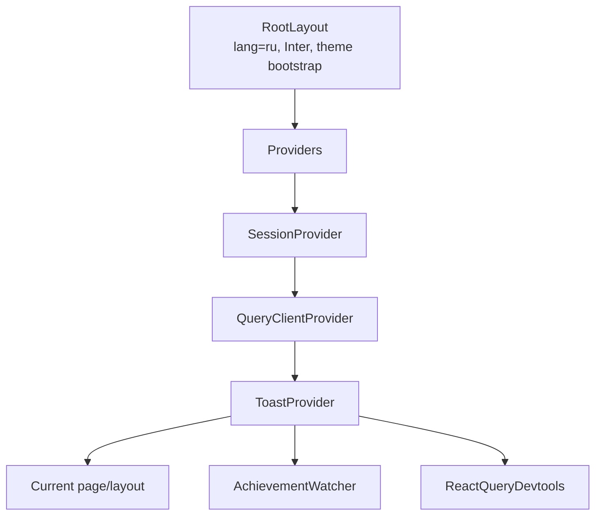
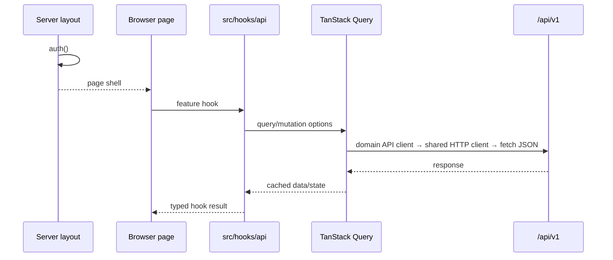

# Frontend

## Технологическая модель

Frontend построен на Next.js 15 App Router и React 19. Прикладные экраны в основном являются client components, а server components используются для корневой композиции, проверки сессии и статического публичного содержимого.

Основные зависимости:

- TanStack Query — server state и мутации;
- Auth.js `SessionProvider` — клиентское состояние сессии;
- Tailwind CSS — layout и дизайн-токены;
- Radix UI — доступные dialog/select/popover primitives;
- React Hook Form — только форма feedback;
- Zod — shared validation schemas;
- Lucide — иконки.

Глобального client store нет; локальное состояние хранится в `useState`,
производное — в `useMemo`.

## Дерево композиции

`Providers` создаёт один `QueryClient` на lifetime смонтированного root provider tree; reload/remount создаёт новый. Query по умолчанию имеет `staleTime = 60 секунд` и один retry, а invite query явно задаёт `retry: false`. Persistence, offline queue, server prefetch/dehydrate и общие mutation defaults отсутствуют.

React Query Devtools подключён в общем provider tree. Production-поведение панели полагается на внутренний production guard пакета.

## Маршрутизация

Route groups в скобках организуют layouts и не входят в URL.

| URL | Исходник | Граница/назначение |
|---|---|---|
| `/` | `src/app/page.tsx` | Публичный server-rendered landing; вошедший пользователь перенаправляется в dashboard |
| `/login` | `src/app/(auth)/login/page.tsx` | Credentials login |
| `/register` | `src/app/(auth)/register/page.tsx` | Регистрация и автоматический login |
| `/faq` | `src/app/faq/page.tsx` | Публичный FAQ или FAQ внутри dashboard shell для вошедшего пользователя |
| `/invite/[token]` | `src/app/invite/[token]/page.tsx` | Просмотр и принятие приглашения |
| `/dashboard` | `src/app/(dashboard)/dashboard/page.tsx` | Итоговые балансы и группы |
| `/groups` | `src/app/(dashboard)/groups/page.tsx` | Список активных групп |
| `/groups/new` | `src/app/(dashboard)/groups/new/page.tsx` | Создание группы и предварительное добавление пользователей |
| `/groups/[id]` | `src/app/(dashboard)/groups/[id]/page.tsx` | Основной workspace группы |
| `/groups/[id]/settings` | `src/app/(dashboard)/groups/[id]/settings/page.tsx` | Участники, реквизиты, invite, rename/leave/delete |
| `/activity` | `src/app/(dashboard)/activity/page.tsx` | Сводная активность по группам |
| `/profile` | `src/app/(dashboard)/profile/page.tsx` | Профиль, статистика, достижения и logout |
| `/feedback` | `src/app/(dashboard)/feedback/page.tsx` | Отправка обратной связи |
| `/admin/feedback` | `src/app/(admin)/admin/feedback/page.tsx` | Application-admin список feedback |

Специализированных `loading.tsx`, `error.tsx` и `not-found.tsx` нет. Состояния загрузки и ошибок обрабатываются локально в компонентах.

## Layout-ы и границы доступа

### Root layout

`src/app/layout.tsx` задаёт русский язык документа, metadata, Inter с latin/cyrillic subset и все глобальные providers. Inline script до hydration восстанавливает `dark` class из `localStorage` или system preference и уменьшает flash неправильной темы.

### Auth layout

`src/app/(auth)/layout.tsx` server-side проверяет сессию. Уже вошедший пользователь не видит login/register и перенаправляется на `/`.

### Dashboard layout

`src/app/(dashboard)/layout.tsx` выполняет authoritative `auth()` check и оборачивает страницу в `DashboardShell`. Shell содержит desktop sidebar, mobile bottom navigation и прокручиваемый main region.

### Admin layout

`src/app/(admin)/layout.tsx` отдельно проверяет сессию и `session.user.role === 'ADMIN'`. Это UI boundary; admin API повторяет проверку независимо.

### Middleware

`src/middleware.ts` смотрит только на наличие session cookie и делает ранний UX redirect. Он не валидирует JWT и не является security boundary. Middleware не авторизует API: защищённые v1 routes проверяют session сами, registration остаётся публичным, а `/api/auth` обслуживает Auth.js.

## Получение данных

Прикладные API-данные не prefetch-ятся server-side и не гидратируются в Query cache. Server components при этом выполняют `auth()` и выбирают layout. После прохождения server layout guard client page вызывает feature hook из `src/hooks/api`; hook настраивает TanStack Query и обращается к domain API client. По умолчанию HTTP client использует same-origin `/api/v1`; build-time base URL задаётся через `NEXT_PUBLIC_API_BASE_URL` и для его смены нужен новый web build. Пока авторизация основана на Auth.js cookie, вынесенный backend следует публиковать через same-origin reverse proxy/BFF. Прямой cross-origin вызов потребует отдельного bearer/OIDC и CORS-контракта.

Единая HTTP-граница находится в `src/lib/api/client`: только `http-client.ts`
вызывает `fetch`, а domain clients скрывают base URL и сборку URL. Feature pages и
components не импортируют эти clients напрямую: их единственная прикладная граница —
hooks из `src/hooks/api`.
HTTP client централизует cookie credentials, optional bearer token, JSON encode/decode,
`204`/`205`, `AbortSignal`, request ID и нормализацию transport-ошибок в `ApiError`.
Domain clients для create group/expense/manual settlement/feedback используют его
idempotent-вариант: UUID ключ привязан к method/path/canonical body, удаляется после
успеха или определённой 4xx-ошибки и сохраняется для повтора после network/5xx/408/425/429.
Hooks централизуют query/mutation options, проброс cancellation signal, pagination и
cache invalidation. `query-keys.ts` является единственным каталогом ключей, а
`invalidation.ts` описывает зависимости записей от cached projections. Option factories
экспортируются отдельно от thin `useQuery`/`useMutation` wrappers и тестируются без UI.

Архитектурный тест сканирует весь `src`, запрещает обход HTTP client, прямой импорт
domain API clients вне `src/hooks/api`, прямой TanStack Query в feature pages/components
и зависимости frontend от services, Prisma, backend routes/validation/persistence.
Два намеренных infrastructure-исключения — корневой `Providers` и
`AchievementWatcher`, которому нужен доступ к global MutationCache. Request и response
transport DTO генерируются из canonical OpenAPI в `contracts/generated/typescript`;
приложение импортирует именованные aliases только через `@contract/v1`. Проверка
`npm run contract:check` не позволяет спецификации и generated types разойтись.
На границе feature hooks
каждый transport-ответ явно преобразуется mapper-ами из `src/lib/api/view-models/mappers.ts`
в самостоятельные модели из `src/lib/api/view-models/models.ts`. Query cache поэтому
хранит уже `GroupViewModel`, `ExpenseViewModel`, `ProfileViewModel` и другие UI-модели,
а не transport envelopes. Например, техническое `_count.expenses` преобразуется в
стабильное `expenseCount`. Feature pages и components не импортируют transport DTO;
это ограничение, как и запрет локальных копий моделей, проверяет архитектурный тест.

JSON responses на клиенте не проходят runtime schema validation: compile-time shape
защищает generated contract, а фактическое нарушение новым backend обнаруживают HTTP
contract и полный candidate E2E gate.

`SessionProvider` не получает session, уже прочитанную server layout-ом. Поэтому browser отдельно загружает client session; имя пользователя и admin navigation могут появиться после первоначального shell render.

## Query cache

| Query key | Источник | Основной потребитель |
|---|---|---|
| `['overview']` | `GET /balances/overview` | Dashboard |
| `['groups']` | `GET /groups?cursor=` | Cursor infinite query для dashboard и списка групп |
| `['group', groupId]` | `GET /groups/:id` | Group workspace/settings |
| `['expenses', groupId]` | `GET /groups/:id/expenses?cursor=` | Infinite query расходов |
| `['balances', groupId]` | `GET /groups/:id/balances` | Workspace группы |
| `['activity']` | `GET /activity?cursor=` | Единая cursor-лента активности без `1+N` |
| `['profile']` | `GET /users/me` | Профиль |
| `['statistics']` | `GET /users/me/statistics` | Статистика профиля |
| `['achievements']` | `GET /users/me/achievements` | Достижения |
| `['users', 'search', normalizedQuery]` | `GET /users/search?q=` | Поиск участников; query выключен для строки короче двух символов |
| `['invite', token]` | `GET /invites/:token` | Страница приглашения |
| `['admin', 'feedback']` | `GET /admin/feedback` | Admin page |

Group list и expense list используют cursor-based `useInfiniteQuery` со
страницей 30, account activity и settlements — со страницей 50. Сервер
возвращает opaque `nextCursor`; dashboard, `/groups` и `/activity` сохраняют уже
загруженные элементы при ошибке continuation и повторяют следующую страницу по
кнопке. Фильтрация расходов по
участнику, remembered manual rate и recent currencies вычисляются только по уже
загруженным страницам.

## Мутации и инвалидация

Optimistic updates не используются. Mutation hooks вызывают централизованные правила
из `invalidation.ts`; components отвечают только за toast, dialog state, session update и
navigation. Совпавшие active queries TanStack Query перечитывает, а удалённые сущности
удаляются из cache явно.

| Сценарий | Инвалидируемые ключи |
|---|---|
| Создание группы | groups, overview, activity, achievements, statistics |
| Rename/requisites/member add/remove | groups, group detail, activity, group balances, overview, achievements, statistics |
| Выход из группы | Предыдущий набор; group detail, group expense list и group balances удаляются из cache |
| Удаление группы | предыдущий набор; group detail, group expense list и group balances удаляются из cache |
| Создание расхода | groups, group detail, expenses, group balances, overview, activity, achievements, statistics |
| Изменение расхода | набор создания плюс expense detail |
| Удаление расхода | набор создания; expense detail удаляется из cache |
| Создание/сброс расчётов | groups, group detail, group balances, overview, activity, achievements, statistics |
| Создание invite | achievements, statistics |
| Отзыв invite | Все cached invite keys по prefix `invite` |
| Принятие invite | group-набор и текущий invite token |
| Изменение профиля | profile и prefixes group/groups/expenses/balances/settlements/user search, overview, activity, achievements, statistics, admin feedback |
| Создание feedback | admin feedback |
| Получение новых achievement unlocks | achievements, только если ответ непустой |
| Регистрация | Cache invalidation отсутствует; затем выполняется отдельный Auth.js sign-in |

QueryClient явно не очищается при смене identity и полагается на полную навигацию
Auth.js. Правила намеренно используют широкие invalidation prefixes вместо точечного
patch/normalized entity cache: это надёжнее для текущего размера, но создаёт лишние
повторные запросы.

## Глобальные UI-механизмы

### Toasts

`ToastProvider` — собственный контекст и stack уведомлений. Обычный toast живёт четыре секунды, achievement toast — шесть. Стек закреплён в правом нижнем углу.

### Achievement watcher

`AchievementWatcher` подписывается на global MutationCache. При установлении authenticated session state и после каждой успешной TanStack mutation он с debounce 500 мс вызывает stable callback `useCollectUnseenAchievements`. Callback намеренно не является mutation hook, иначе собственный успешный POST рекурсивно запускал бы watcher. Полученные награды показываются с интервалом 900 мс; непустой ответ инвалидирует achievement query. Ошибка этого вспомогательного потока сознательно подавляется.

### Theme

`src/hooks/use-theme.ts` переключает `light/dark`, изменяет class корневого элемента и `localStorage`. Автоматического отслеживания последующих изменений system preference или storage events нет. Sidebar и MobileNav смонтированы одновременно и имеют независимое theme state, поэтому после toggle и смены breakpoint скрытый control может показывать устаревшее состояние. Auth/invite backgrounds используют светлые gradients без dark variants.

## Формы и client validation

Только feedback системно использует React Hook Form с `zodResolver` и shared schema. Login/register и доменные формы построены на controlled `useState`, локальных checks/parsers и окончательной server validation.

- Expense form переводит decimal input в integer scale через `parseMoneyInput` и отдельно обрабатывает `RATE_UNAVAILABLE`.
- Settlement/group/profile/settings имеют собственные способы декодирования ошибок.
- User search в new group/settings запускается от двух символов через общий query hook;
  TanStack Query отменяет устаревший request и разделяет cache по нормализованной строке,
  но debounce отсутствует.

## Компонентные слои

### Layout

- `DashboardShell`;
- `Sidebar`;
- `MobileNav`;
- `PublicHeader`.

### Feature components

- `ExpenseForm` — создание/изменение расхода, split modes, курсы и наличные;
- `SettlementForm` — фиксация долга и отображение реквизитов;
- `StatisticsSection` и `AchievementsSection`;
- `RequisitesNudgeDialog`;
- `AchievementWatcher`;
- `FaqContent`.

### UI primitives

В `src/components/ui` находятся button, card, input, textarea, label, select, dialog, badge, avatar, skeleton, separator, currency select, theme toggle и toast. Variants кнопки построены через CVA, conditional classes — через `cn`.

Основные hotspots связанности:

- group page — около 698 строк;
- group settings page — около 446 строк;
- expense form — около 414 строк.

HTTP orchestration и cache policy из этих файлов уже вынесены в `src/hooks/api`, но они
по-прежнему объединяют локальные view types, permission-derived UI, финансовое form/view
state, диалоги и разметку.

## Пользовательские сценарии

### Регистрация и вход

Регистрация создаёт пользователя через API и затем выполняет credentials sign-in. Login передаёт Credentials provider email/password и после успеха переходит на callback или корневой URL. Root page отправляет вошедшего пользователя на dashboard.

### Создание группы

Пользователь задаёт имя, тип, валюту расчёта и может найти зарегистрированных людей по имени. Backend всегда добавляет creator как admin. После создания UI инвалидирует список групп и открывает workspace.

### Приглашение

Участник получает многоразовую ссылку из settings, admin может её отозвать. Неавторизованный получатель сначала проходит login, затем API проверяет токен и добавляет его в группу как `MEMBER`.

### Расход

Форма по умолчанию выбирает текущего пользователя плательщиком, всех участников, валюту группы, текущую дату и `EQUAL`. Дополнительно доступны subset участников, `EXACT`, `PERCENTAGE`, иностранная валюта, ручной курс, заметка и наличные платежи. При `RATE_UNAVAILABLE` форма переводит ручной курс в обязательное состояние.

### Баланс и расчёт

Workspace показывает упрощённые долги. Кнопка оплаты доступна текущему пользователю только на его исходящем долге. Settlement form предлагает сумму долга, реквизиты получателя, дату и заметку; частичная оплата разрешена.

### Settings

В settings admin может изменить название, добавить/удалить участников, отозвать invite и удалить группу. Обычный участник может выйти. Любой участник может получить active invite и изменить собственные group-specific реквизиты. Кнопка admin reset manual settlements находится в основном workspace группы, не в settings.

### Профиль и история

Профиль объединяет lifetime statistics, список достижений, имя и реквизиты.
Activity page получает единую cursor-ленту через `/api/v1/activity`, а на клиенте
только группирует уже загруженные события для отображения.

## Responsive и accessibility

На `md+` используется sidebar шириной 16rem, на мобильных — fixed bottom navigation и дополнительный нижний padding контента. Expense create/edit dialogs ограничены по высоте и прокручиваются; остальные dialogs полагаются на базовый `DialogContent`. Content grids переключаются на `sm/lg` breakpoints.

Radix primitives дают базовую keyboard/focus semantics для dialog/select/popover. Известные пробелы:

- часть фильтров реализована clickable `div` без keyboard role;
- custom participant toggles не всегда имеют `aria-pressed`/checkbox semantics;
- не у всех icon-only controls есть `aria-label`;
- toast stack не объявлен через `aria-live`;
- skip link отсутствует;
- toast и mobile navigation могут пересекаться на узком viewport.

## Ошибочные состояния UI

HTTP client преобразует неоднородные legacy envelopes в единый `ApiError`, а
query-экраны используют общий `QueryErrorState` с retry. Отдельные E2E-сценарии
фиксируют recovery для dashboard, groups, group detail/settings, profile,
statistics/achievements, feedback и пагинации.

Activity получает единую серверную страницу, группирует уже загруженные записи для UI
и явно показывает continuation/error следующей страницы.

Остаётся системный пробел:

- общей реакции на `401` после истечения client session нет: каждый query или
  mutation получает обычный `ApiError`, но единый re-auth/logout flow не
  запускается.
