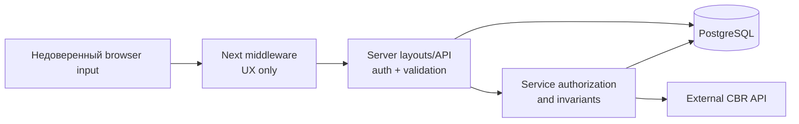

# Безопасность

## Trust boundaries

Authoritative boundaries:

- server layouts защищают UI route groups;
- каждый `/api/v1` route, кроме регистрации и credentials authentication boundary, проверяет session;
- group-scoped операции проверяют active membership и/или role;
- критические мутации повторяют authorization/state checks внутри transaction;
- Zod проверяет большинство JSON command DTO; path/query/Auth.js inputs валидируются отдельно или вручную только частично;
- Prisma parameterization отделяет пользовательский ввод от SQL.

Middleware проверяет только наличие cookie и не валидирует session/JWT. Его redirect — ранняя UX-оптимизация, а не контроль доступа.

## Аутентификация

Auth.js v5 использует Credentials provider.

1. Email нормализуется через `trim().toLowerCase()` и проходит validation.
2. Auth.js вызывает публичный `POST /api/v1/auth/credentials` через отдельный
   server-side client; endpoint возвращает только стабильные identity claims.
3. User ищется по нормализованному email, пароль сравнивается с bcrypt hash.
4. При login формируется JWT session.
5. В token сохраняются user ID, name и application role.
6. Session callback раскрывает их server/client коду.

Registration хэширует пароль `bcrypt.hash(password, 10)`. Общая boundary-проверка ограничивает пароль 72 UTF-8 байтами; тот же guard выполняется до bcrypt compare при login, поэтому пароль с одинаковым bcrypt-prefix и лишним suffix не принимается. Password hash не включается в public projections и API-ответы.

Особенности JWT strategy:

- server-side session storage и централизованного revoke списка нет;
- роль, записанная в JWT, сохраняется до нового sign-in/выпуска нового token; обычный session update обновляет только name;
- изменение `ADMIN_EMAIL` не меняет уже выпущенный token немедленно;
- смена имени отдельно поддержана session update callback.

## Два уровня ролей

### Application role

`ADMIN` назначается при login, если email пользователя точно совпадает с `ADMIN_EMAIL`. Роль даёт доступ к `/admin/feedback` и соответствующему API.

Роль не хранится в таблице User. Если email из `ADMIN_EMAIL` ещё не занят, публичная регистрация позволяет создать его, после чего владелец credentials получит admin при login. Безопасное развёртывание должно заранее контролировать ownership этого адреса или заменить env-based назначение на явную provisioning policy.

### Group role

`GroupMember.role` хранится в БД независимо от application role.

| Операция | Требование |
|---|---|
| Просмотр группы, расходов, balances, settlements, activity | Active member |
| Создание расхода | Active member; payer/participants тоже active |
| Редактирование расхода | Creator, payer либо group admin |
| Удаление расхода | Creator либо group admin |
| Rename/delete group | Group admin |
| Добавление/удаление другого member | Group admin |
| Самостоятельный выход | Сам member, но не admin |
| Создание/получение invite | Active member |
| Отзыв invite | Group admin |
| Создание settlement | Только authenticated debtor по текущему suggested edge |
| Сброс manual settlements | Group admin |
| Изменение group requisites | Только собственная membership row |

Application admin автоматически не становится group admin.

## Приватность данных

### Платёжные реквизиты

Profile и membership хранят имя получателя, банк и номер карты/телефона. В ответе текущему пользователю service вычисляет simplified debt graph и оставляет видимыми:

- его собственные реквизиты;
- реквизиты `toUserId` из долгов, где текущий пользователь является `fromUserId`, то есть его кредиторов.

Следовательно, реквизиты конкретного пользователя раскрываются ему самому и участникам, которые сейчас должны ему. Для остальных обнуляются group overrides и profile defaults. Это server-side фильтрация до JSON response.

После expense create/update/delete и settlement create/reset frontend
инвалидирует group detail вместе с balances, overview и зависимыми query. Новая
projection реквизитов запрашивается после изменения debt graph; authoritative
privacy boundary по-прежнему находится в server-side mapper/service.

Реквизиты и active invite token хранятся в PostgreSQL открытым текстом; field-level encryption и hash-at-rest для invite отсутствуют. Lifetime peer/money facts сохраняются после удаления source groups. При этом self-service API/UI удаления аккаунта нет, а большинство user foreign keys используют `RESTRICT`, поэтому практический data-erasure flow не реализован.

### Поиск пользователей

Authenticated user может искать других пользователей по части имени. Ответ ограничен десятью строками и содержит только ID, name и avatar URL; email не возвращается.

### Feedback

Feedback доступен application admin и содержит message, имя и email автора. Endpoint ограничен последними 100 строками.

### Activity

Activity доступна только active members группы. Metadata может содержать имя участника, название/сумму расхода и сведения о расчёте; эти данные живут до удаления группы.

## Валидация и целостность

Zod schemas защищают JSON command types, длины, money ranges, split totals, supported currencies и avatar scheme. Query/path values и Auth.js credentials имеют неполную ручную/framework validation: большинство IDs/tokens не проверяются по shape/length, search query не имеет max length. Services проверяют членство, роли, debt amount и бизнес-инварианты.

На уровне PostgreSQL отсутствуют CHECK constraints для:

- положительности денежных сумм;
- supported currency;
- `fromUserId != toUserId`;
- суммы exact/percentage splits;
- согласованности `amountBase` и валюты группы.

Поэтому целостность гарантирована только при записи через текущий application layer. Seed, ручной SQL или другой writer способны создать состояние, которое API не допустил бы.

## Обработка ошибок и утечка информации

Известные domain errors преобразуются в локализованные сообщения, unknown exception возвращается как generic «Внутренняя ошибка». Registration route отдельно возвращает подсказку о БД/миграциях, но без stack trace.

Client получает неоднородные error shapes. В production обработанные ошибки не выдают server stack и Prisma details; неперехваченные routes полагаются на стандартное скрытие деталей Next.js. В development framework diagnostics могут быть подробнее. Unknown exception не получает contextual structured application log, поэтому расследование затруднено.

## Web security controls

Текущая конфигурация не задаёт явно:

- Content Security Policy;
- frame ancestors/X-Frame-Options;
- Referrer-Policy;
- Permissions-Policy;
- HSTS на уровне приложения;
- Origin/CSRF validation для custom mutation routes;
- application-level request/body/rate limits.

Часть базовых cookie/auth controls предоставляет Auth.js, а transport headers могут устанавливаться внешним reverse proxy, но в repository такая конфигурация не зафиксирована.

`GET /users/me/achievements` является safe read. Синхронизация и атомарная выдача уведомлений вынесены в `POST /achievements/unseen`; для публичного deployment этому custom mutation по-прежнему нужна общая CSRF/origin policy.

`next.config.ts` разрешает Next Image загружать изображение с любого HTTPS hostname. Текущий UI почти везде показывает initials и не использует `next/image` для avatar URL, но при будущем включении image optimization wildcard расширит server-side outbound surface и должен быть заменён allowlist-ом.

Root layout использует `dangerouslySetInnerHTML` только для статического theme bootstrap script; пользовательские данные в него не подставляются.

## Abuse resistance

Rate limiting отсутствует для:

- credentials login;
- публичной регистрации;
- user search;
- feedback;
- создания расходов/расчётов/invites.

Также нет CAPTCHA, email verification, account lockout, password reset и MFA. Это приемлемо только для ограниченного personal deployment с внешней сетевой защитой; публичный интернет deployment требует отдельной abuse policy.

Public registration различает новый и уже занятый email через 201/409, поэтому является unauthenticated account-enumeration oracle.

Registration и login нормализуют email через `trim().toLowerCase()` до поиска и
записи. PostgreSQL unique index остаётся case-sensitive сам по себе, поэтому
инвариант регистра зависит от обязательного использования этой application
boundary всеми будущими write paths.

Array size limits не определены, поэтому authenticated client способен отправить крупные `memberIds`, `splits` или `cashPayments`. Application-level body limit не задан; фактическое ограничение зависит от Next.js runtime и reverse proxy.

## Navigation и callback URL

Middleware сохраняет исходный pathname в `callbackUrl`. Login/register
пропускают параметр через общий `getSafeAuthCallback`: принимается только
относительный URL текущего origin, а absolute, protocol-relative, malformed и
script URL заменяются на `/`.

Ссылки между login и registration не переносят существующий callback URL, поэтому invite destination может потеряться при переключении формы.

## Invite security

Invite token генерируется через `crypto.randomUUID()` без дефисов. Токен:

- многоразовый;
- не имеет срока действия;
- не ограничен количеством применений;
- отзывается admin-ом;
- требует authenticated session для просмотра и принятия.

Логирование полного invite URL в сторонних системах или утечка browser history даёт доступ любому вошедшему пользователю до отзыва ссылки.

## Middleware special paths

До обычной auth-логики middleware обрабатывает intentional easter egg:

- `/q/86f2a1` возвращает подсказку;
- специальный header `x-the-way` возвращает JSON greeting.

Эти ветки доступны до session check и short-circuit обычный request независимо от pathname. Они не раскрывают доменные данные, но являются дополнительным публичным поведением, которое нужно учитывать при security review и observability.

## Secrets и deployment boundary

Repository содержит только пример значений. Production должен передавать secrets через platform secret store и не встраивать их в image.

Из-за безусловного `trustHost: true` reverse proxy обязан очищать недоверенные и выставлять корректные `Host`/`Forwarded` headers; приложение само не содержит allowlist доверенных hosts.

Минимальные требования:

- криптографически стойкий `AUTH_SECRET`;
- TLS termination и корректный forwarded host;
- закрытый PostgreSQL endpoint с TLS/сетевым ACL;
- контролируемый `ADMIN_EMAIL`;
- отдельные credentials для каждого окружения;
- ограниченный outbound HTTPS egress к ЦБ;
- backup и audit доступа к БД с платёжными реквизитами.
