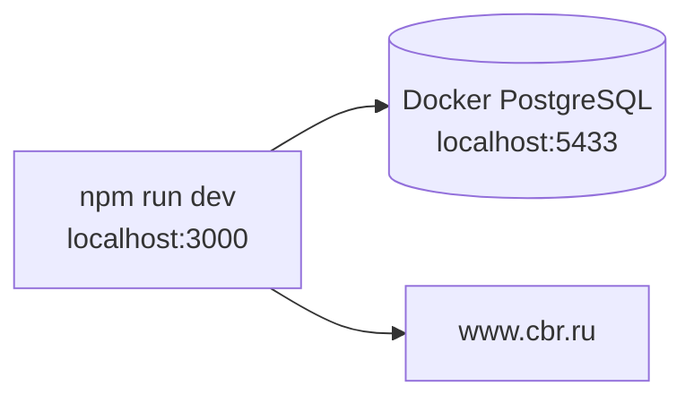
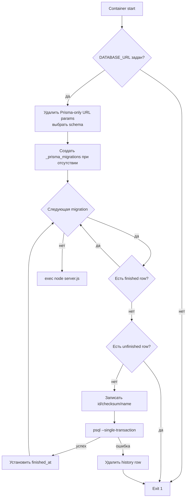

# Развёртывание и эксплуатация

## Конфигурация

| Переменная | Назначение | Обязательность |
|---|---|---|
| `DATABASE_URL` | PostgreSQL DSN для Prisma и migration entrypoint | Обязательна; entrypoint валидирует наличие |
| `AUTH_SECRET` | Подпись/шифрование Auth.js token state | Обязательна для корректного production auth, но startup явно не проверяет |
| `AUTH_URL` | Публичный URL Auth.js | Зависит от окружения; указан в `.env.example` |
| `ADMIN_EMAIL` | Email application admin | Необязательна; без совпадения admin UI/API недоступны |
| `NEXT_PUBLIC_API_BASE_URL` | Build-time base URL browser API client | Необязательна; по умолчанию `/api/v1`, для cookie auth рекомендуется same-origin |
| `BACKEND_API_BASE_URL` | Absolute base URL server-side credentials client, включая `/api/v1` | Необязательна при заданном `AUTH_URL`; иначе обязательна для login boundary |
| `NODE_ENV` | Режим Next.js/Prisma | В image установлен `production` |
| `HOSTNAME`, `PORT` | Bind standalone server | В image: `0.0.0.0:3000` |

Auth.js настроен с `trustHost: true`. Исторические имена `NEXTAUTH_SECRET/NEXTAUTH_URL` встречаются в `SETUP.md`, а актуальный `.env.example` использует `AUTH_SECRET/AUTH_URL`.

Prisma runtime читает connection limit, pool timeout, schema, SSL и pgbouncer mode из query parameters `DATABASE_URL`; отдельного properties/configuration слоя нет. Migration entrypoint удаляет Prisma-only `schema/connection_limit/pool_timeout/pgbouncer` из DSN для `psql`, сохраняет PostgreSQL параметры вроде `sslmode`, а schema передаёт через `PGOPTIONS search_path`.

## Локальная топология

`docker-compose.yml` поднимает только PostgreSQL 16 Alpine:

- host port 5433 -> container port 5432;
- база, user и password `splitwise`;
- named volume `postgres_data`;
- healthcheck через `pg_isready`.

Приложение запускается на host через `npm run dev` и не входит в compose.



Обычный локальный bootstrap:

1. установить зависимости;
2. запустить PostgreSQL;
3. выполнить Prisma migration;
4. опционально выполнить seed;
5. запустить Next.js dev server.

`npm run dev` сам по себе миграции не применяет.

## Production image

Dockerfile использует три стадии.

### dependencies

- base: `node:22-alpine`;
- `npm ci` по lockfile.

### builder

- получает `node_modules` и исходники;
- выполняет `npx prisma generate`;
- выполняет `npm run build`;
- Next.js формирует standalone output.

### runner

- base: `node:22-alpine`;
- устанавливает только `postgresql-client`;
- создаёт непривилегированного пользователя `nextjs`;
- копирует `.next/standalone`, `.next/static`, SQL-миграции и entrypoint;
- открывает порт 3000;
- запускает `docker-entrypoint.sh`, затем `node server.js`.

Runner не копирует каталог `public`, а Next standalone output не включает его автоматически. Поэтому существующие `public/robots.txt`, `public/.well-known/security.txt` и будущие public assets отсутствуют в runner filesystem и не обслуживаются этим image, если deployment отдельно их не монтирует; repository такого mount не описывает.

Дополнительно `robots.txt` ссылается на `/sitemap.xml`, но sitemap file/route отсутствует, а middleware не считает этот URL public и отправляет гостя на login.

## Применение миграций при старте

В production не используется `prisma migrate deploy`. Custom entrypoint применяет SQL напрямую через `psql`.



Положительные свойства:

- fail-fast при отсутствии DB URL или ошибке SQL;
- валидация имени schema;
- каждая SQL migration выполняется транзакционно;
- Prisma CLI не нужен в runtime image;
- standalone server работает не от root.

Эксплуатационные ограничения:

- distributed/advisory lock отсутствует: параллельный старт нескольких replica может одновременно применить одну migration;
- `migration_name` в вручную созданной history table не уникален;
- записанный checksum не сравнивается с уже применённой migration;
- crash между history insert, SQL commit и `finished_at` создаёт состояния, требующие ручного восстановления;
- metadata update не атомарен с SQL migration commit;
- любая будущая migration принудительно оборачивается в transaction, что несовместимо с некоторыми PostgreSQL операциями;
- readiness retry БД отсутствует: оркестратор должен перезапустить container;
- recovery/runbook для custom migration engine не описан.

## CI/CD

`.github/workflows/publish.yml` запускается для pull request, push в `main/master`, version tags и вручную.

Pipeline:

1. checkout;
2. Node.js 22, `npm ci` и Prisma generate;
3. typecheck, OpenAPI contract и language-neutral golden suites;
4. полный unit/DB suite с coverage thresholds на изолированной test database;
5. оптимизированный Next.js build;
6. 225 Playwright HTTP/browser E2E против локального standalone artifact на
   сбрасываемой `splitwise_e2e`;
7. Buildx setup, login в GHCR для non-PR и генерация image tags;
8. build linux/amd64 image с GHA cache/provenance и push для non-PR;
9. HTTP redeploy webhook для non-PR.

Pipeline блокирует публикацию при падении typecheck, contract, golden, coverage,
build или E2E. Пока отсутствуют отдельные lint, dependency/security scan,
проверка запуска собранного Docker image и smoke/recovery test именно custom
migration entrypoint.

## Внешняя интеграция с ЦБ РФ

`exchange.service.ts` обращается к:

```text
https://www.cbr.ru/scripts/XML_daily.asp?date_req=DD/MM/YYYY
```

Характеристики:

- timeout 5 секунд через `AbortSignal.timeout`;
- `force-cache` для прошлых дат и `no-store` для текущей и будущих дат;
- XML windows-1251 читается как latin1, необходимые ASCII tags разбираются regex;
- дата корневого XML response не проверяется: rates сохраняются под запрошенным `day`, даже если источник фактически вернул данные за другую дату;
- одним `createMany(skipDuplicates)` сохраняются все найденные курсы даты;
- курс хранится как RUB за единицу валюты;
- при ошибке используется ближайший к дате cached rate без ограничения максимального расстояния;
- при отсутствии fallback создаётся `RATE_UNAVAILABLE`, UI предлагает ручной курс.

Для foreign-currency операций production требует DNS/HTTPS egress к ЦБ либо предварительно наполненный кэш/ручной курс.

## Prisma runtime

`src/lib/db.ts` создаёт один Prisma Client. В development instance хранится в `globalThis`, чтобы hot reload не создавал новые pools. В production используется module singleton. Включён только Prisma error log.

Сервисы используют обычные queries и interactive transactions. Наиболее чувствительные финансовые операции используют isolation level `Serializable` и общий bounded retry Prisma `P2034`: максимум три попытки с exponential backoff и jitter, затем стабильный `TRANSACTION_CONFLICT`.

## Seed

`prisma/seed.ts` создаёт три demo users, одну RUB-группу, два расхода, splits и activity.

Особенности:

- users создаются через upsert;
- group и операции при каждом повторном запуске создаются заново;
- seed пишет Prisma напрямую, минуя service-level history/statistics orchestration;
- `amountBase` у demo RUB операций остаётся null, и balance fallback использует `amount`;
- seed запускается после migrations/backfill и не создаёт `UserStatisticFact`, поэтому последующее удаление demo group не оставит такую же lifetime-историю, как обычные service-created данные;
- сразу после seed demo expenses/groups/money также отсутствуют в lifetime statistics endpoint; achievements частично компенсируют это чтением live metrics;
- обработчик `.catch(console.error)` не выставляет non-zero exit code явно.

Seed предназначен для локальной/demo среды и не должен выполняться в production.

Migration-built database сохраняет исходные single-column индексы `expenses_groupId_idx` и `settlements_groupId_idx` вместе с более поздними composite `(groupId, date DESC)`. Prisma schema объявляет только composite варианты, поэтому фактическая БД содержит redundant indexes и дополнительную write cost.

## Наблюдаемость

Текущая observability минимальна:

- Prisma пишет ошибки;
- registration route пишет unexpected exception через `console.error`;
- HTTP access log, structured application log, correlation/request ID, tracing и метрики не настроены;
- health/readiness endpoint приложения отсутствует;
- Docker `HEALTHCHECK` для app отсутствует;
- alerting/SLO не описаны.

`handleServiceError` возвращает generic 500, но не логирует unexpected exception. Это защищает детали от клиента, однако усложняет production investigation.

## Операционные runbooks, которых сейчас нет

- backup/restore PostgreSQL;
- rollback image и migration compatibility;
- восстановление unfinished custom migration;
- ротация `AUTH_SECRET`;
- смена application admin;
- заполнение/очистка exchange rate cache;
- readiness/liveness и инциденты недоступности ЦБ;
- capacity limits для Prisma pool и Node.js runtime.
