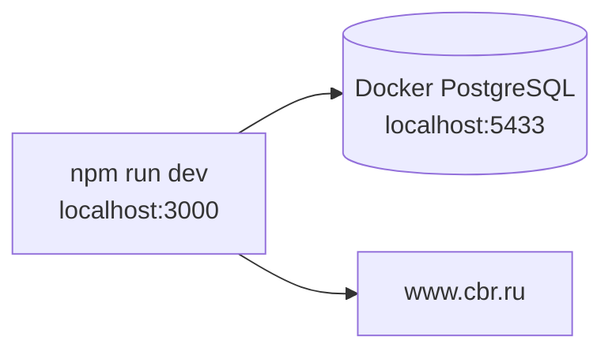
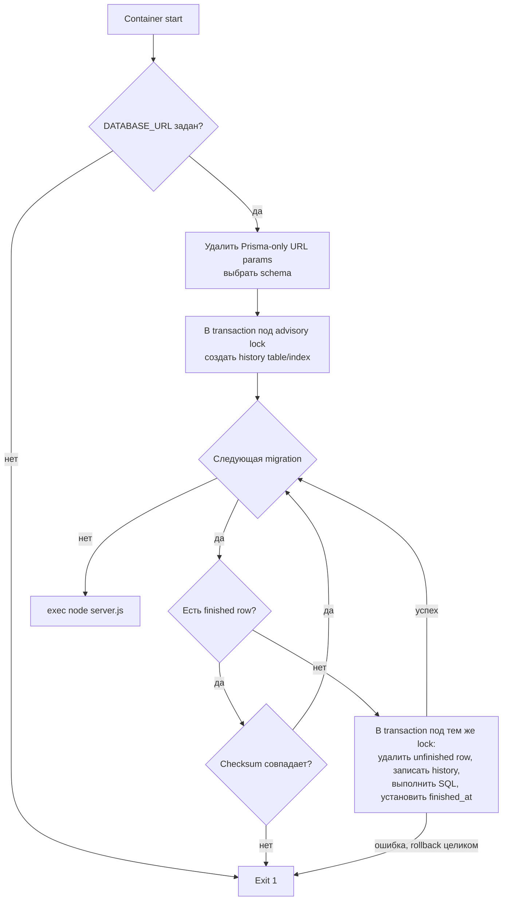

# Развёртывание и эксплуатация

## Конфигурация

| Переменная | Назначение | Обязательность |
|---|---|---|
| `DATABASE_URL` | PostgreSQL DSN для Prisma и migration entrypoint | Обязательна; entrypoint валидирует наличие |
| `AUTH_SECRET` | Подпись/шифрование Auth.js token state | Обязательна для корректного production auth, но startup явно не проверяет |
| `AUTH_URL` | Публичный URL Auth.js | Зависит от окружения; указан в `.env.example` |
| `ADMIN_EMAIL` | Email application admin | Необязательна; без совпадения admin UI/API недоступны |
| `NEXT_PUBLIC_API_BASE_URL` | Build-time base URL browser API client | Необязательна; по умолчанию `/api/v1`, для cookie auth рекомендуется same-origin |
| `BACKEND_API_BASE_URL` | Absolute base URL server-side credentials client, включая `/api/v1` | Необязательна при заданном `AUTH_URL`; иначе обязательна для login boundary |
| `NODE_ENV` | Режим Next.js/Prisma | В image установлен `production` |
| `HOSTNAME`, `PORT` | Bind standalone server | В image: `0.0.0.0:3000` |

Auth.js настроен с `trustHost: true`. Канонические имена переменных —
`AUTH_SECRET` и `AUTH_URL`; они же используются в `.env.example` и `SETUP.md`.

Prisma runtime нормализует DSN и при отсутствии явных значений добавляет bounded
defaults: `connection_limit=10`, `pool_timeout=10`, `connect_timeout=5` и
`socket_timeout=15`. Явные параметры оператора сохраняются. Migration entrypoint
удаляет Prisma-only `schema/connection_limit/pool_timeout/socket_timeout/pgbouncer`
из DSN для `psql`, сохраняет PostgreSQL параметры вроде `sslmode`, а schema
передаёт через `PGOPTIONS search_path`.

## Локальная топология

`docker-compose.yml` поднимает только PostgreSQL 16 Alpine:

- host port 5433 -> container port 5432;
- база, user и password `splitwise`;
- named volume `postgres_data`;
- healthcheck через `pg_isready`.

Приложение запускается на host через `npm run dev` и не входит в compose.



Обычный локальный bootstrap:

1. скопировать `.env.example` в `.env`, который читают Prisma CLI и Next.js;
2. запустить PostgreSQL через `docker compose up -d db`;
3. выполнить `npm run setup`, который устанавливает зависимости, генерирует
   Prisma Client и применяет готовые миграции;
4. запустить Next.js через `npm run dev`;
5. создать первый аккаунт через registration UI.

`npm run dev` сам по себе миграции не применяет.

## Production image

Dockerfile использует три стадии.

### dependencies

- base: `node:22-alpine`;
- `npm ci` по lockfile.

### builder

- получает `node_modules` и исходники;
- выполняет `npx prisma generate`;
- выполняет `npm run build`;
- Next.js формирует standalone output.

### runner

- base: `node:22-alpine`;
- устанавливает только `postgresql-client`;
- создаёт непривилегированного пользователя `nextjs`;
- копирует `.next/standalone`, `.next/static`, `public`, SQL-миграции и entrypoint;
- открывает порт 3000;
- проверяет `/api/health/ready` через Docker `HEALTHCHECK`;
- запускает `docker-entrypoint.sh`, затем `node server.js`.

Runner явно копирует каталог `public`, поскольку Next standalone output не
включает его автоматически. Существующие `robots.txt`,
`.well-known/security.txt` и будущие public assets поэтому входят в image.

## Применение миграций при старте

В production не используется `prisma migrate deploy`. Custom entrypoint применяет SQL напрямую через `psql`.



Положительные свойства:

- fail-fast при отсутствии DB URL или ошибке SQL;
- валидация имени schema;
- каждая SQL migration выполняется транзакционно;
- Prisma CLI не нужен в runtime image;
- standalone server работает не от root.

Эксплуатационные свойства и ограничения:

- PostgreSQL advisory transaction lock сериализует migrator replicas в рамках
  одной schema;
- partial unique index запрещает две finished history rows с одним именем;
- checksum уже применённого файла обязательно сравнивается перед startup;
- history insert, SQL migration и `finished_at` входят в одну transaction;
- незавершённая history row безопасно удаляется перед повторной попыткой;
- любая будущая migration принудительно оборачивается в transaction, что несовместимо с некоторыми PostgreSQL операциями;
- entrypoint не ожидает доступности БД: при startup race оркестратор должен
  перезапустить container;
- recovery/runbook и автоматический image smoke пока не описаны.

Fresh-install baseline `20260915000000_initial_schema` содержит полную текущую
схему. Она не содержит upgrade, cleanup или backfill старых данных.
Безопасный checksum/advisory-lock runner сохранён для идемпотентного запуска
нескольких container replicas; это эксплуатационная защита, а не legacy chain.
Baseline выполняет `CREATE EXTENSION IF NOT EXISTS citext` и `pg_trgm`.
Application/migration role поэтому должен иметь право создавать эти расширения,
либо platform operator должен установить их до запуска migrator.

## CI/CD

`.github/workflows/publish.yml` запускается для pull request, push в `main/master`, version tags и вручную.

Pipeline:

1. checkout;
2. Node.js 22, `npm ci` и Prisma generate;
3. typecheck, OpenAPI contract и language-neutral golden suites;
4. полный unit/DB suite с coverage thresholds на изолированной test database;
5. оптимизированный Next.js build;
6. полный Playwright HTTP/browser E2E-набор против локального standalone artifact на
   сбрасываемой `splitwise_e2e`;
7. Buildx setup, login в GHCR для non-PR и генерация image tags;
8. build linux/amd64 image с GHA cache/provenance и push для non-PR;
9. HTTP redeploy webhook для non-PR.

Pipeline блокирует публикацию при падении typecheck, contract, golden, coverage,
build или E2E. Пока отсутствуют отдельные lint, dependency/security scan,
проверка запуска собранного Docker image и smoke/recovery test именно custom
migration entrypoint.

## Внешняя интеграция с ЦБ РФ

`exchange.service.ts` обращается к:

```text
https://www.cbr.ru/scripts/XML_daily.asp?date_req=DD/MM/YYYY
```

Характеристики:

- timeout 5 секунд через `AbortSignal.timeout`;
- `force-cache` для прошлых дат и `no-store` для текущей и будущих дат;
- XML windows-1251 читается как latin1, необходимые ASCII tags разбираются regex;
- дата корневого XML response не проверяется: rates сохраняются под запрошенным `day`, даже если источник фактически вернул данные за другую дату;
- одним `createMany(skipDuplicates)` сохраняются все найденные курсы даты;
- курс хранится как RUB за единицу валюты;
- при ошибке используется ближайший к дате cached rate без ограничения максимального расстояния;
- при отсутствии fallback создаётся `RATE_UNAVAILABLE`, UI предлагает ручной курс.

Для foreign-currency операций production требует DNS/HTTPS egress к ЦБ либо предварительно наполненный кэш/ручной курс.

## Prisma runtime

`src/lib/db.ts` создаёт один Prisma Client с нормализованным bounded DSN. В
development instance хранится в `globalThis`, чтобы hot reload не создавал новые
pools. В production используется module singleton. Включён только Prisma error log.

Сервисы используют обычные queries и interactive transactions. Наиболее чувствительные финансовые операции используют isolation level `Serializable`, ранний per-group advisory lock и общий bounded retry Prisma `P2034`/PostgreSQL `40001`/`40P01`: максимум три попытки с exponential backoff и jitter, затем стабильный `TRANSACTION_CONFLICT`.

## Fresh initialization

Единственная baseline migration создаёт схему, ограничения, projections,
triggers и индексы, но не создаёт пользователей или demo-данные. Первый
пользователь появляется только через registration API. Cursor indexes сразу
входят в baseline: `(groupId, date DESC, createdAt DESC, id DESC)` для expenses
и settlements, `(groupId, createdAt DESC, id DESC)` для activity и
`(createdAt DESC, id DESC)` для feedback.

## Наблюдаемость

Текущая observability минимальна:

- Prisma пишет ошибки;
- registration route пишет unexpected exception через `console.error`;
- HTTP access log, structured application log, correlation/request ID, tracing и метрики не настроены;
- `GET /api/health/live` проверяет жизнь процесса без DB;
- `GET /api/health/ready` выполняет bounded DB probe и возвращает 503 при
  неготовности; Docker `HEALTHCHECK` использует этот endpoint;
- alerting/SLO не описаны.

`handleServiceError` возвращает generic 500, но не логирует unexpected exception. Это защищает детали от клиента, однако усложняет production investigation.

## Операционные runbooks, которых сейчас нет

- backup/restore PostgreSQL;
- rollback image и migration compatibility;
- восстановление unfinished custom migration;
- ротация `AUTH_SECRET`;
- смена application admin;
- заполнение/очистка exchange rate cache;
- инциденты недоступности ЦБ;
- tuning bounded Prisma pool и Node.js runtime под реальную нагрузку;
- сверка и восстановление projections (команда
  `npm run db:rebuild-projections`, для test DB — вариант `:test`).
