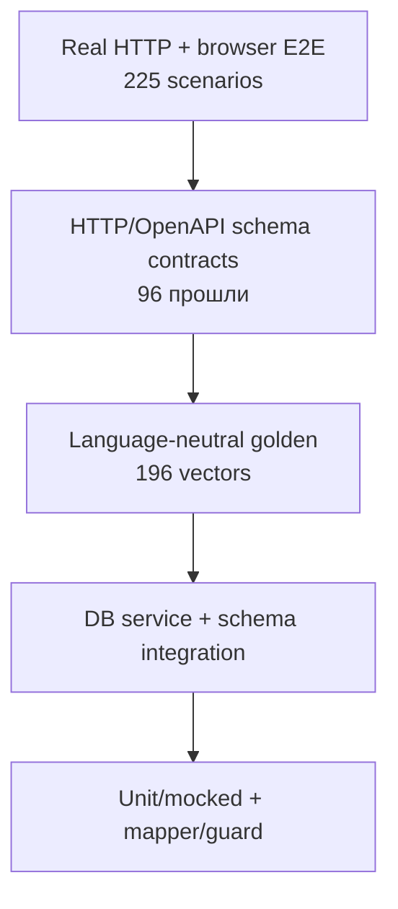

# Тестирование и качество

## Инструменты

Тестовый runner — Vitest 4. Конфигурация:

- environment `node`;
- globals включены;
- include `src/**/*.test.ts` и `contracts/**/*.test.ts`;
- alias `@` указывает на `src`;
- setup-файл подменяет `DATABASE_URL` на проверенный `TEST_DATABASE_URL` только для DB-контура;
- V8 coverage проверяет backend/contract boundary с обязательными порогами:
  statements 90%, branches 85%, functions 90%, lines 92%.

Файлы `*.test.tsx` конфигурацией не включаются.

## Команды

| Команда | Назначение |
|---|---|
| `npm test` | Быстрые unit/mocked suites; DB suites пропускаются |
| `npm run typecheck` | TypeScript strict typecheck без emit |
| `npm run contract:check` | Generated TypeScript transport types байт-в-байт соответствуют OpenAPI |
| `npm run test:contract` | OpenAPI/source parity и mocked HTTP route contract tests |
| `npm run test:golden` | Schema/runner tests и 196 language-neutral vectors против legacy adapter |
| `npm run test:watch` | Интерактивный Vitest |
| `npm run test:db` | Полный suite на `TEST_DATABASE_URL` с последовательным выполнением файлов |
| `npm run test:coverage` | Полный DB suite на `TEST_DATABASE_URL` с V8 coverage |
| `npm run test:e2e` | Полный HTTP/browser E2E-набор на чистой локальной `splitwise_e2e` с `next dev` |
| `npm run test:e2e:production` | Тот же E2E-набор на чистой локальной `splitwise_e2e` с собранным `.next/standalone` |
| `npm run test:e2e:candidate` | Тот же suite против внешнего replacement stack через язык-независимый fixture adapter |
| `npm run test:e2e:headed` | Тот же E2E-контур с видимым Chrome |
| `npm run test:e2e:ui` | Интерактивный Playwright UI |
| `npx tsc --noEmit` | Проверка типов |
| `npm run build` | Prisma generation внутри image выполняется отдельно, затем оптимизированный Next.js build |
| `npm run test:quality` | Typecheck, unit/contract, golden и оптимизированный Next.js build |
| `npm run test:regression` | Полный gate: quality, DB и E2E |

DB runner выставляет `RUN_DB_INTEGRATION_TESTS=true`, применяет pending migrations и запускает Vitest с `--no-file-parallelism`, обязательным из-за конфликтов Serializable transactions между тестовыми файлами. По умолчанию URL выводится из `DATABASE_URL` заменой имени на `<database>_test`; `TEST_DATABASE_URL` позволяет задать иной адрес. Guard требует PostgreSQL, самостоятельный маркер `test` в имени и несовпадение с application `DATABASE_URL`; после проверки setup подменяет URL до импорта Prisma.

### Терминология и изоляция локальных E2E

Слово `production` в историческом имени команды `test:e2e:production` означает
только `NODE_ENV=production` и запуск оптимизированного Next.js artifact через
`.next/standalone/server.js`. Команда не подключается к production-окружению,
production-БД или внешнему трафику. Далее этот режим называется **локальным
standalone runtime**.

Оба локальных E2E-режима поднимают приложение на loopback-интерфейсе и работают
только с тестовой PostgreSQL в Docker. `global-setup` принимает исключительно БД
с маркером `_e2e`/`-e2e`, перед каждым полным прогоном сбрасывает её и применяет
миграции заново. Разница между режимами только в способе запуска того же кода:

- `npm run test:e2e` запускает локальный `next dev`;
- `npm run test:e2e:production` запускает локальный `.next/standalone/server.js`.

## Полная проверка

`npm run test:regression` последовательно запускает quality gate, DB integration
и E2E на собранном standalone artifact. Coverage использует только защищённую
`splitwise_test`, а E2E перед прогоном сбрасывает только `splitwise_e2e` и
применяет fresh-install baseline. Guard запрещает application/production DB и
имя без явного test-маркера.

Точные количества тестов и проценты покрытия не дублируются в документации:
актуальный результат хранит CI, а thresholds — test configuration. Отдельный
Docker image smoke всё ещё нужен для проверки упаковки image и custom migration
entrypoint. Обычный `npm test` к БД не подключается.

## Быстрый контур

Unit и mocked tests покрывают:

- денежное форматирование, parsing и даты;
- equal/exact/percentage split algorithm;
- balance simplification;
- позицию пользователя в расходе;
- поддерживаемые валюты;
- Zod validation расходов, групп, расчётов, профиля и feedback;
- achievement definitions/evaluation/icons;
- преобразование статистики;
- HTTP mapping доменных ошибок;
- Auth.js callbacks и Credentials authorization с mocks;
- отдельную pure simulation сброса расчётов.

Отдельный HTTP contract suite напрямую вызывает все v1 route handlers с
mocked auth/services/Prisma. Он фиксирует 34 success responses, единый 401 для
32 защищённых операций, validation/error envelopes, route-specific 403/404,
registration без session и явные response projections. Fixtures содержат
полные resource shapes и проверяют, что persistence-only поля не попадают в
JSON. Каждый успешный handler-response проходит JSON Schema из OpenAPI; coverage
операций выводится из самой спецификации, поэтому новая операция без response-
примера роняет suite. Response objects закрыты для лишних полей на любом уровне.
Request schemas сохраняют фактическую v1-семантику strip unknown fields.

Golden-контур хранит 196 JSON-сценариев в `contracts/golden`: expense/splits/FX,
balances/settlements, membership/dates, account activity pagination,
statistics/achievements и auth/errors.
Текущий manifest запускается через legacy TypeScript adapter. Runner технически
умеет подключать будущий candidate process adapter и сравнивать результаты, но
реальный backend-кандидат пока отсутствует; поэтому suite ещё не является
доказанным backend-to-backend parity gate. Compare-режим отличает ADR-approved
расхождения от неожиданного drift; протокол не зависит от языка реализации.

Чистые финансовые функции хорошо изолированы от framework и БД, поэтому их матрицы выполняются быстро и детерминированно.

## DB-интеграционный контур

DB-интеграционные файлы регистрируют сценарии для реальных Prisma/service flows:

| Suite | Основной охват |
|---|---|
| `expenses.service.test.ts` | CRUD, authorization, splits, currency, cash settlement lifecycle, pagination, atomicity |
| `groups.service.test.ts` | Create/update/delete, members, roles, balances, cascade behavior |
| `settlements.service.test.ts` | Debt validation, partial payment, membership, transaction behavior |
| `balances.service.test.ts` | Group и overview balances |
| `exchange.service.test.ts` | CBR parsing/cache/fallback/conversion |
| `invites.service.test.ts` | Create/revoke/accept/reactivation role reset |
| `achievements.service.test.ts` | Persisted unlock и notification behavior |
| `feedback.service.test.ts` | Create/list |
| `persistence.integration.test.ts` | Cross-service persistence, cascades, lifetime facts |
| `persistence-atomicity.integration.test.ts` | Rollback и отсутствие частичных side effects |
| `persistence-concurrency.integration.test.ts` | Serializable conflicts, retry и idempotency |
| `persistence-constraints.integration.test.ts` | FK/unique/check/deferred invariants, financial identity и cascades |
| `persistence-schema.integration.test.ts` | Storage types, indexes, triggers и rebuild functions |
| `persistence-projections.integration.test.ts` | Parity balance/statistic projections и их атомарный rebuild |
| `persistence-money.integration.test.ts` | Money/FX границы и точное minor-unit округление |
| `statistics-history.integration.test.ts` | Lifetime history после edit/delete/group lifecycle |

Тесты создают и удаляют строки только в `TEST_DATABASE_URL`. Команда применяет миграции, но не поднимает PostgreSQL и не создаёт саму БД: окружение должно предоставить изолированную БД с выведенным или явно заданным именем.

Устаревшее ожидание `summary.total > 60` заменено сравнением с экспортируемым `ACHIEVEMENT_COUNT`, поэтому DB-тест больше не дублирует изменяемый размер каталога достижений.

## HTTP/browser E2E-контур

Playwright-тесты разнесены по предметным файлам в `e2e`, а не собраны в один
монолитный сценарий. Отдельные suites покрывают:

- регистрацию, login/logout, callback/open redirect и повреждённую session cookie;
- desktop/mobile navigation, role-based UI и отсутствие runtime console/page errors;
- lifecycle групп, настройки, участников, выход/возврат и приглашения;
- equal/exact/percentage splits, FX, округление, календарные даты и денежные границы;
- создание, изменение, удаление и cursor-пагинацию расходов и групп;
- наличные и ручные расчёты, balances/overview, requisites и reset;
- activity, lifetime statistics, achievements и однократную выдачу уведомлений;
- profile, feedback, admin UI, authorization и validation envelopes реального HTTP;
- конкурентные расходы, расчёты, membership и приглашения;
- транзакционный rollback, inactive membership и FX/money rounding boundaries;
- mass assignment, forged ownership, XSS/SQL/path payloads;
- UI loading/error/retry, deep links, keyboard/focus, mobile layout и theme/FAQ;
- live dashboard через реальный API/DB без route mocks;
- отзыв платёжных реквизитов после полного расчёта;
- раскрытие percentage/FX/cash/notes деталей расхода;
- полную anonymous/forbidden HTTP-матрицу и recovery приглашений.

Отдельный `group-pagination.spec.ts` принудительно создаёт 31 membership с одним
`updatedAt`, проверяет стабильный `id` tie-break на HTTP-границе, отсутствие дублей
после «Показать ещё» и retry второй страницы без потери уже показанных карточек.
Установка одинакового timestamp использует только guarded local `_e2e` database;
сценарий явно пропускается против внешнего candidate backend.

`activity-account-feed.spec.ts` фиксирует account-level cursor continuity,
невидимость истории inactive membership и сетевую границу: один batch request и
ноль `/groups/:id/activity`. Recovery-сценарий оставляет первые 50 событий на
экране после исчерпания query retry и проверяет успешную ручную дозагрузку 51-го.

`e2e/global-setup.ts` принимает только URL БД с маркером `_e2e`/`-e2e`, создаёт
БД при отсутствии, выполняет `prisma migrate reset` и создаёт фиксированных
пользователей. Suite выполняется с `workers: 1`: сценарии используют уникальные
имена сущностей, но одну локальную БД. При ошибке сохраняются trace и screenshot;
HTML-report пишется в `playwright-report`. Оба каталога артефактов исключены из Git.

В candidate-режиме global setup не подключает Prisma и не управляет схемой нового
backend. Он передаёт versioned JSON fixture внешнему executable из
`E2E_FIXTURE_ADAPTER`; протокол и JSON Schema находятся в `contracts/e2e`.

## Test pyramid

## Сильные стороны

- плотное покрытие арифметики и boundary validation;
- DB test code охватывает права, последовательные transaction rechecks и cascades;
- проверка happy path, edge cases и error cases;
- финансовые суммы и время в большинстве unit tests заданы явно;
- service boundary тестируется без поднятия Next.js context.
- success-ответы DB-backed routes проходят через явные transport mapper-ы;
- legacy и будущий Kotlin backend могут использовать одни golden JSON fixtures.

## Непокрытые уровни

- Firefox/WebKit и настоящие mobile browser engines; сейчас E2E запускается в Chrome;
- автоматический axe-аудит accessibility и visual regression;
- exhaustive chaos/fallback states для продолжительных и частичных сетевых сбоев;
- автоматизированный custom migration entrypoint/image smoke и recovery paths;
- upgrade from previous schema не поддерживается: текущая migration рассчитана
  только на fresh installation;
- Docker image smoke/startup/health;
- нагрузочные конкурентные прогоны и длительный contention; базовые реальные race-сценарии покрыты;
- CI deploy webhook failure/rollback;
- security infrastructure, которой пока нет в приложении: rate limiting и CSRF abuse monitoring.

Фактические DB-paths дополнительно проверяют atomic rollback snapshots,
constraints/cascades, денежные границы, историю statistics и реальные
конкурентные settlement/invite/membership операции с Serializable retry.

## Quality gates

В repository нет lint script. TypeScript strict включён, но `skipLibCheck` также включён.
Coverage thresholds enforced в `vitest.config.ts`.

Publish workflow до сборки image запускает typecheck, OpenAPI contract, golden,
полный DB suite с coverage thresholds, оптимизированный Next.js build и все
Playwright E2E против локально поднятого `.next/standalone/server.js` и
изолированной CI test database.
Deploy не начинается при падении любого слоя.

## Рекомендуемый порядок локальной проверки изменений

1. `npx tsc --noEmit`;
2. `npm test`;
3. для contract/domain semantics — `npm run test:contract` и `npm run test:golden`;
4. для изменений services/schema/migrations — `npm run test:db` на изолированной БД;
5. `npm run build`;
6. `npm run test:e2e` для проверки через локальный `next dev`;
7. `npm run test:e2e:production` после `npm run build` для проверки локального
   standalone artifact перед merge/release.
