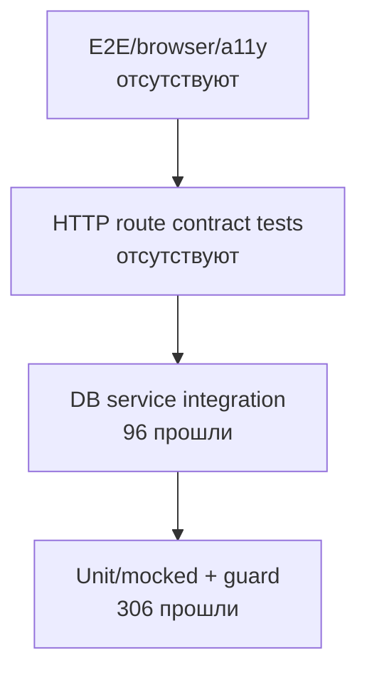

# Тестирование и качество

## Инструменты

Тестовый runner — Vitest 4. Конфигурация:

- environment `node`;
- globals включены;
- include только `src/**/*.test.ts`;
- alias `@` указывает на `src`;
- setup-файл подменяет `DATABASE_URL` на проверенный `TEST_DATABASE_URL` только для DB-контура;
- coverage thresholds не заданы.

Файлы `*.test.tsx` конфигурацией не включаются.

## Команды

| Команда | Назначение |
|---|---|
| `npm test` | Быстрые unit/mocked suites; DB suites пропускаются |
| `npm run test:watch` | Интерактивный Vitest |
| `npm run test:db` | Полный suite на `TEST_DATABASE_URL` с последовательным выполнением файлов |
| `npm run test:coverage` | Полный DB suite на `TEST_DATABASE_URL` с V8 coverage |
| `npx tsc --noEmit` | Проверка типов |
| `npm run build` | Prisma generation внутри image выполняется отдельно, затем production Next build |

DB runner выставляет `RUN_DB_INTEGRATION_TESTS=true`, применяет pending migrations и запускает Vitest с `--no-file-parallelism`, обязательным из-за конфликтов Serializable transactions между тестовыми файлами. По умолчанию URL выводится из `DATABASE_URL` заменой имени на `<database>_test`; `TEST_DATABASE_URL` позволяет задать иной адрес. Guard требует PostgreSQL, самостоятельный маркер `test` в имени и несовпадение с application `DATABASE_URL`; после проверки setup подменяет URL до импорта Prisma.

## Фактический результат повторной проверки

Snapshot: 12 сентября 2026 года, `HEAD 05f7644`, production source без изменений кроме существующего IDE-файла и новых architecture docs.

```text
Fast run:   19 files passed, 9 skipped; 306 tests passed, 96 skipped
Full run:   28 files passed; 402 tests passed
TypeScript: no errors
Build:      passed with network access to Google Fonts
```

Полный run выполнен на отдельной `splitwise_test` после применения всех 16 миграций. Обычный `npm test` не подключается к БД и оставляет 96 DB-сценариев skipped.

## Быстрый контур

Unit и mocked tests покрывают:

- денежное форматирование, parsing и даты;
- equal/exact/percentage split algorithm;
- balance simplification;
- позицию пользователя в расходе;
- поддерживаемые валюты;
- Zod validation расходов, групп, расчётов, профиля и feedback;
- achievement definitions/evaluation/icons;
- преобразование статистики;
- HTTP mapping доменных ошибок;
- Auth.js callbacks и Credentials authorization с mocks;
- отдельную pure simulation сброса расчётов.

Чистые финансовые функции хорошо изолированы от framework и БД, поэтому их матрицы выполняются быстро и детерминированно.

## DB-интеграционный контур

Девять файлов регистрируют 96 сценариев для реальных Prisma/service flows:

| Suite | Основной охват |
|---|---|
| `expenses.service.test.ts` | CRUD, authorization, splits, currency, cash settlement lifecycle, pagination, atomicity |
| `groups.service.test.ts` | Create/update/delete, members, roles, balances, cascade behavior |
| `settlements.service.test.ts` | Debt validation, partial payment, membership, transaction behavior |
| `balances.service.test.ts` | Group и overview balances |
| `exchange.service.test.ts` | CBR parsing/cache/fallback/conversion |
| `invites.service.test.ts` | Create/revoke/accept/reactivation role reset |
| `achievements.service.test.ts` | Persisted unlock и notification behavior |
| `feedback.service.test.ts` | Create/list |
| `persistence.integration.test.ts` | Cross-service persistence, cascades, lifetime facts |

Тесты создают и удаляют строки только в `TEST_DATABASE_URL`. Команда применяет миграции, но не поднимает PostgreSQL и не создаёт саму БД: окружение должно предоставить изолированную БД с выведенным или явно заданным именем.

Устаревшее ожидание `summary.total > 60` заменено сравнением с экспортируемым `ACHIEVEMENT_COUNT`, поэтому DB-тест больше не дублирует изменяемый размер каталога достижений.

## Test pyramid



## Сильные стороны

- плотное покрытие арифметики и boundary validation;
- DB test code охватывает права, последовательные transaction rechecks и cascades;
- проверка happy path, edge cases и error cases;
- финансовые суммы и время в большинстве unit tests заданы явно;
- service boundary тестируется без поднятия Next.js context.

## Непокрытые уровни

- API route handlers и единообразие HTTP contracts;
- React components, hooks, query invalidation и error states;
- routing/login/invite end-to-end flows;
- responsive UI, theme и accessibility;
- custom migration entrypoint, upgrade from older schemas и recovery paths;
- Docker image smoke/startup/health;
- реальные конкурентные запросы и handling serialization conflict;
- CI deploy webhook failure/rollback;
- security cases: rate limiting, hostile avatar URL, callback URL.

`settlements-reset.test.ts` проверяет локальную модель reset behavior, а не фактический Prisma path `resetSettlements`; основная уверенность в реальном поведении получается из остальных DB suites.

DB-сценарии проверяют race-sensitive guards последовательно, но не создают конкурирующие запросы и не воспроизводят Prisma `P2034`.

## Quality gates

В repository нет lint script. TypeScript strict включён, но `skipLibCheck` также включён. Coverage можно собрать, однако minimum thresholds не enforced.

Publish workflow собирает Docker image. `next build` выполняет собственную TypeScript validation, но workflow не запускает unit/DB tests и отдельный `tsc --noEmit`. Текущий обязательный gate перед deploy фактически равен успешному production build.

## Рекомендуемый порядок локальной проверки изменений

1. `npx tsc --noEmit`;
2. `npm test`;
3. для изменений services/schema/migrations — `npm run test:db` на изолированной БД;
4. `npm run build`;
5. для UI-изменений — ручной browser smoke, пока E2E-контур отсутствует.
