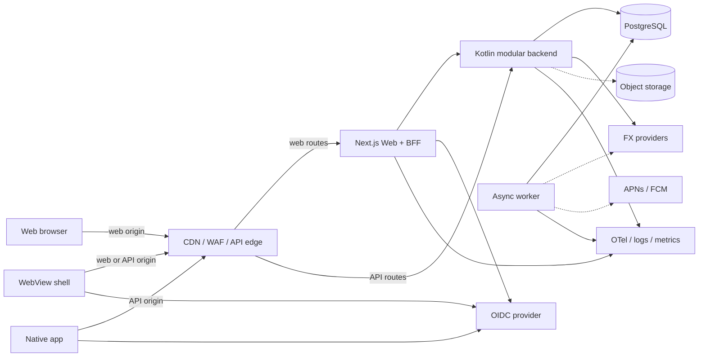
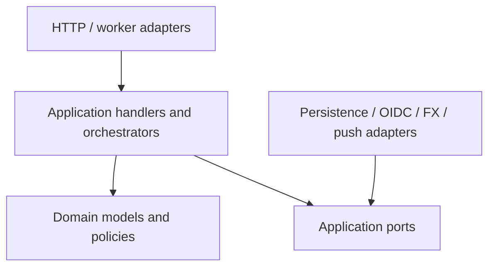

# Целевая архитектура и план полного переписывания

Статус: утверждаемое целевое направление, не описание текущей реализации. Фактическое состояние существующего Next.js-приложения описано в документах `01`–`08`.

Текущий TypeScript-код используется как источник сценариев, инвариантов и
characterization tests, но не как шаблон новой архитектуры.

## Архитектурное решение

Целевая система состоит из:

1. публичного client-agnostic HTTP API;
2. Kotlin/Spring backend в форме модульного монолита;
3. отдельного Next.js web-клиента и тонкого BFF;
4. отдельного worker для производных данных и фоновых задач;
5. PostgreSQL как источника истины финансовых данных;
6. OIDC provider как источника истины identity/credentials;
7. будущих WebView- и native-клиентов, использующих тот же API.

Микросервисы не являются начальной целью. Масштабируемость обеспечивается stateless replicas, правильными SQL/read models, асинхронной обработкой и явными границами модулей. Отдельные сервисы выделяются позже только по измеримой технической или организационной причине.

## Приоритеты качества

В порядке важности:

1. корректность денег, прав доступа и конкурентных операций;
2. возможность безопасно менять код и данные;
3. стабильный контракт для web и mobile;
4. наблюдаемость и восстановление после сбоев;
5. горизонтальное масштабирование;
6. скорость добавления функций;
7. возможность выделения сервисов.

Распределённость, количество процессов и выбор модного framework сами по себе не являются признаками качественной архитектуры.

## Системный контекст



Начальные workloads:

| Workload | Ответственность | Состояние |
|---|---|---|
| Web/BFF | UI, SSR, browser session, CSRF, web-specific aggregation | Stateless compute replicas; authoritative encrypted sessions в общей PostgreSQL BFF-schema |
| Backend API | Commands, authoritative queries, authorization, транзакции | Stateless |
| Worker | Outbox consumers, projections, notifications, scheduled jobs | Lease/checkpoint в PostgreSQL |
| Migrator | Единственное применение schema migrations | One-shot release job |

Backend, worker и migrator собираются из одного backend image и запускаются в разных режимах. Web имеет отдельный image. Kubernetes, Kafka, Redis и read replicas не обязательны для первого production-релиза.

## Клиентская архитектура

### Web

Next.js отвечает за рендеринг, навигацию и browser-specific UX. BFF:

- хранит в browser только opaque session ID в `HttpOnly`, `Secure`, `SameSite`
  cookie; access/refresh tokens шифруются server-side в session store;
- выполняет CSRF/Origin/Fetch-Metadata проверки;
- получает и обновляет короткоживущий OAuth access token с backend audience;
- агрегирует только представления, специфичные для web;
- не содержит финансовых правил и не обращается к доменным таблицам.

Browser вызывает same-origin BFF, BFF добавляет backend bearer token и вызывает
`/api/v2`; native/WebView networking layer вызывает `/api/v2` напрямую с OAuth
bearer. Backend не принимает browser cookie как credential.

Session store принадлежит Web/Auth boundary, а не доменному backend. На первом
этапе он размещается в отдельной `web_auth` schema управляемого PostgreSQL с
отдельной restricted DB role и собственными миграциями BFF; Web не получает
доступа к доменным таблицам. Все BFF replicas используют один store, записи
имеют абсолютный TTL и очищаются фоновым job. Refresh tokens шифруются ключом из
secret manager; в БД хранится версия ключа для контролируемой ротации.

При недоступности store BFF работает fail-closed: не принимает session cookie,
не использует process-local fallback и не вызывает backend со stale token.
Store использует multi-AZ/backup/restore политику PostgreSQL, ограниченные
connection/statement timeouts и readiness, которая выводит нездоровую BFF
replica из трафика. Такая схема сохраняет горизонтальную масштабируемость Web;
выделенный Redis рассматривается только при подтверждённой нагрузке.

Web использует сгенерированный TypeScript client из OpenAPI. Компоненты не описывают API DTO вручную.

### WebView

WebView рассматривается как способ быстрее выпустить mobile shell, а не как отдельный backend.

- основной UI остаётся responsive web;
- login открывается в system browser через Authorization Code + PKCE, а не внутри embedded WebView;
- возврат выполняется через Universal Links/App Links;
- long-lived access/refresh token не передаётся в JavaScript bridge;
- native bridge ограничен task-specific allowlist-командами: push registration, camera/share и biometric unlock; raw Keychain/Keystore API в bridge не выдаётся;
- web content загружается только с доверенного origin, arbitrary navigation блокируется;
- версия shell и доступные bridge capabilities передаются явно.

Допустимы две модели сессии:

1. WebView использует обычный Web/BFF cookie flow после одноразового session bootstrap code.
2. Native shell держит OAuth token в OS secure storage и добавляет bearer через ограниченный networking layer.

Первая модель проще и безопаснее для минимальной оболочки. Вторая нужна только если WebView тесно взаимодействует с native API. Токен нельзя хранить в `localStorage` или выдавать произвольному JavaScript.

### Native

Нативный клиент обращается к public API напрямую:

- OAuth Authorization Code + PKCE;
- токены только в Keychain/Keystore;
- public client без встроенного client secret;
- certificate pinning вводится только вместе с runbook ротации;
- push token регистрируется как отдельная installation, а не поле пользователя;
- deep links используют те же HTTPS invite/resource URLs, что web;
- server является источником истины, local database — cache и очередь неподтверждённых commands.

Native не зависит от Next.js/BFF. Отдельный mobile BFF добавляется только при измеримой необходимости в другом payload/latency profile, а не как обязательный слой.

Решение между отдельными iOS/Android приложениями, Kotlin Multiplatform и другим cross-platform framework принимается позже. Backend и контракт от этого не зависят.

### Общие правила клиентов

- один public API, разные authentication profiles;
- opaque string IDs и client-generated idempotency keys;
- optimistic concurrency через resource version/ETag;
- cursor pagination и bounded responses;
- явные loading/error/empty/offline states;
- сервер возвращает machine-readable error code, клиент локализует сообщение;
- mobile release policy задаёт minimum supported client version и срок поддержки старых контрактов;
- breaking API changes публикуются новой major version.

Offline-first синхронизация не реализуется заранее. Контракт уже позволяет безопасно повторить command и разрешить version conflict; change feed, tombstones и полноценный sync protocol добавляются только при подтверждённом offline product requirement.

## Структура repository

Для одной продуктовой команды практичен polyglot monorepo:

```text
apps/
  web/                    # Next.js
  mobile/                 # появится после выбора native/WebView стратегии
backend/                  # single-module Kotlin/Gradle service
contracts/
  openapi/                # canonical public и internal specs
  test-vectors/           # money, dates, ledger, errors
generated/
  typescript-client/      # генерируется, не редактируется вручную
docs/
  architecture/
```

Monorepo позволяет атомарно менять контракт, backend и web до появления независимых команд. Отдельные repositories нужны только при реальной независимости release/access ownership.

## Backend: доменные модули

### Identity & Accounts

Владеет отображением `(issuer, subject) -> localAccountId`, профилем без платёжных реквизитов, account status и application-level roles. Пароли и browser sessions предпочтительно принадлежат внешнему OIDC provider.

### Shared Expenses Core

Единая транзакционная граница для:

- Groups;
- Membership и group roles;
- Invites;
- Expenses и splits;
- Settlements;
- Ledger postings;
- authoritative group positions;
- правил выхода участника и закрытия группы.

Expense, Settlement, Membership и Balance нельзя превращать в разные сетевые сервисы: одна команда проверяет и изменяет их согласованное состояние.

### Payee Details

Владеет default/group-specific реквизитами, PII retention и политикой раскрытия. Реквизиты хранятся отдельно от `GroupMember` и не входят в общий group DTO.

Settlement instructions выдаются только после проверки отрицательной raw
position запрашивающего и положительной raw position выбранного получателя в
том же read snapshot. Simplified debt edge не является authorization rule. В
security audit записывается факт доступа, но не содержимое реквизитов.

### FX

Владеет источниками курса, cache, freshness, provenance и conversion policy. Core вызывает `FxQuoteProvider` до открытия финансовой DB-транзакции. Same-currency и user-provided rate не зависят от внешней сети.

### Activity

Строит пользовательскую ленту из доменных событий. Это eventual-consistent read model, которую можно перестроить из event archive в пределах retention.

### Insights

Владеет статистикой, achievements и progress. Не участвует в financial commit, обрабатывает события идемпотентно и имеет freshness SLO.

### Notifications

Владеет installations, preferences, delivery attempts и adapters APNs/FCM/email. Получает семантические события, не читает таблицы Core и не блокирует commands.

### Feedback & Operations

Владеет feedback, moderation state и операционными административными queries. Security audit остаётся отдельным cross-cutting журналом.

## Backend: слои и код

Новый backend — single-module Gradle Kotlin DSL, Java 21, Spring Boot 3, WebFlux + coroutines, PostgreSQL R2DBC, Flyway, Jackson Kotlin, Micrometer/OpenTelemetry, resilience4j, JUnit 5 и MockK.

```text
backend/src/main/kotlin/<base-package>/
  Application.kt
  CommonConfiguration.kt
  domain/<context>/...
  application/<context>/command/...
  application/<context>/query/...
  application/<context>/handler/...
  application/<context>/port/...
  infrastructure/http/...
  infrastructure/persistence/<context>/...
  infrastructure/security/...
  infrastructure/outbox/...
backend/src/main/resources/
  application.yml
  application-local.yml
  application-dev.yml
  application-test.yml
  logback-spring.xml
```

Правила зависимостей:



- transport DTO, R2DBC rows и generated OpenAPI models явно преобразуются;
- domain не зависит от Spring, JSON, SQL и transport;
- handler исполняет один use case;
- orchestrator координирует несколько независимых handlers/ports;
- transaction boundary находится в application layer;
- repositories описывают use-case-oriented ports, generic repository запрещён;
- I/O методы `suspend`, без `GlobalScope` и blocking вызовов на event loop;
- время поступает через `Clock`;
- errors — sealed typed hierarchy, а не строки;
- architecture tests запрещают transport/ORM leakage и cross-module table access;
- shared kernel ограничен `Money`, IDs, `Clock`-типами и базовыми error primitives.

Код группируется package-by-context, внутри каждого context сохраняются
`domain/application/infrastructure`. Межмодульный вызов идёт только через
application facade/port владельца; SQL-доступ к чужим таблицам запрещён.
Dependency matrix и эти правила проверяются architecture tests. Выделение
context в сетевой сервис требует отдельного consistency/operations ADR.

REST/OpenAPI используется для client API. gRPC не добавляется, пока нет реального отдельного внутреннего сервиса.

## Финансовая модель

### Money

Domain value object:

```text
Money(currency, scaledAmount, scale)
```

- `scaledAmount` хранится как `BIGINT` и передаётся в API как integer string;
- `scale` определяется versioned currency policy, а не предположением «у всех валют 2 знака»;
- arithmetic использует integer/BigDecimal и проверяет overflow;
- binary floating point для денег и курсов запрещён;
- API явно различает `originalMoney` и `settlementMoney`.

FX rate хранится как `NUMERIC` с заданными precision/scale, base/quote currency, source, effective date и fetched time. Rounding mode зафиксирован ADR как `HALF_EVEN`. Остаток распределяется детерминированно по стабильному порядку participants, чтобы сумма converted splits всегда совпадала с converted expense total.

### Ledger

Source of truth состоит из business entities и сбалансированных postings:

- expense создаёт transaction revision и postings участников;
- settlement создаёт отдельную transaction;
- изменение expense создаёт новую revision, точные reversal postings предыдущей
  revision и полные postings новой revision;
- удаление означает void/reversal, а не физическое исчезновение финансовой истории;
- сумма postings каждой group transaction равна нулю;
- ручное исправление сохраняет actor, reason и correlation ID.

`group_member_position` — command-side transactional index. Он обновляется в той же транзакции, что postings, и используется для проверки settlement, выхода участника и удаления группы. Индекс можно перестроить в shadow table, сверить и атомарно переключить при fenced writes.

Полный event sourcing не требуется: текущие business entities остаются удобным write model, а immutable ledger/audit даёт воспроизводимость финансового состояния.

### Consistency

| Данные | Модель |
|---|---|
| Membership, expense, settlement, postings, positions | Strong consistency, одна local transaction |
| Idempotency result и outbox event | Та же transaction, что command |
| Settlement instructions | Consistent debt check + PII read snapshot |
| Group detail после command | Read-your-writes с primary |
| Activity, achievements, notifications | Eventual consistency с freshness SLO |
| Overview | Асинхронная read model с version/freshness metadata |
| FX cache refresh | Eventual; применённый quote immutable в expense revision |

Core transactions используют Serializable isolation, bounded retry с jitter и aggregate version. Внешний HTTP/push/object-storage I/O никогда не выполняется внутри DB-транзакции.

## Данные и миграции

PostgreSQL остаётся одним operational store до появления доказанной необходимости разделения.

- таблица имеет одного owning module;
- соседние модули не читают её SQL напрямую;
- runtime role имеет DML без DDL;
- migrator имеет отдельные DDL credentials;
- migrations запускаются singleton release job с advisory lock;
- schema evolution: expand → backfill → switch → contract;
- application version N совместима со schema N и N+1 во время rollout;
- backfill имеет checkpoint, throttling, repeatability и reconciliation;
- IDs — UUIDv7 или эквивалентные globally unique opaque values;
- `groupId` является естественным aggregate/partition key, но ранний sharding запрещён.

Managed PostgreSQL в production: multi-AZ, private network/TLS, encryption at rest, PITR и регулярно проверяемый restore.

## API contract

Canonical OpenAPI 3.1 хранится отдельно от implementation. Public spec описывает client API, включая application-admin operations с RBAC; internal overlay — BFF principal token, worker control и health/operations endpoints.

Основные правила `/api/v2`:

- JSON DTO не повторяют DB rows;
- stable `operationId` и generated SDK;
- IDs — opaque strings;
- business date — `YYYY-MM-DD`, instant — RFC 3339 UTC;
- Money — `{ scaledAmount: "12345", scale: 2, currency: "RUB" }`;
- errors — RFC 9457 Problem Details со stable `code`, `traceId`, `fieldErrors`;
- mutation принимает `Idempotency-Key`;
- update принимает ETag/expected version;
- PATCH различает absent, `null` и empty string либо заменяется полным PUT command;
- pagination — opaque cursor и bounded limit;
- response содержит schema/resource version, где это важно для sync;
- GET не имеет side effects;
- request/array/string limits заданы в contract и validation;
- даты, rounding и ledger invariants сопровождаются executable test vectors.

### Idempotency

Scope ключа: `(principalId, operationId, idempotencyKey, API major version)`.

Backend хранит canonical request hash, состояние, исходный status/body или resource ID и expiry. Idempotency record, domain changes и outbox event фиксируются атомарно. Повтор с тем же payload возвращает первоначальный результат; повтор ключа с другим payload отвечает `409`.

Это обязательно для mobile: timeout или смена сети не должны создавать второй expense/settlement.

### Версионирование

Web можно обновлять вместе с backend, mobile — нет. Поэтому:

- additive fields не ломают клиента;
- enum имеет documented unknown handling;
- server не переиспользует прежнее значение с новым смыслом;
- удаление поля проходит deprecation window и telemetry использования;
- minimum client version повышается только с заранее определённым UX обновления;
- BFF не скрывает breaking changes от native API.

## Authentication и authorization

Целевой auth — standards-based OIDC:

- Web/BFF: confidential client, Authorization Code, server-side session;
- Native/WebView shell: public client, Authorization Code + PKCE через system browser;
- Backend: OAuth2 resource server с проверкой issuer, audience, algorithm, `kid`, `nbf`, `exp`, clock skew;
- local identity key: `(issuer, subject) -> localAccountId`;
- email не является immutable identity;
- logout, refresh rotation, revocation и account suspension имеют явную политику.

Authentication централизована, authorization остаётся внутри каждого application use case. Gateway не заменяет membership/role/ownership checks.

## Domain events и worker

Command атомарно пишет domain state и outbox event:

```text
eventId
eventType + schemaVersion
aggregateId + aggregateVersion
actorId
occurredAt
correlationId
minimal immutable payload
```

Worker использует at-least-once delivery:

- отдельная subscription/delivery state на consumer;
- короткий DB lease, без удержания lock во время I/O;
- inbox/deduplication;
- per-aggregate ordering или gap detection;
- bounded retry, quarantine/DLQ и replay tool;
- metrics oldest-event age, attempts, failures и projection lag;
- archive/retention policy, совместимая с PII deletion.

PostgreSQL outbox достаточно на старте. Managed queue добавляется при burst load или независимых workers. Kafka — только при многих consumers, долгом replay и измеримом event throughput.

## Масштабирование

### Сначала

- stateless backend replicas;
- bounded pool budget и PgBouncer при необходимости;
- правильные composite indexes;
- cursor pagination;
- batch loading вместо `1 + N`;
- transactional member positions вместо полного пересчёта ledger;
- user/group overview projections;
- object storage и signed upload URLs для будущих receipt/media;
- CDN для public assets;
- backpressure и concurrency limits worker.

### Потом, по метрикам

- Redis для конкретного hot/read-through cache;
- PostgreSQL read replica для stale-tolerant projections;
- partitioning Activity/outbox/audit по объёму и retention;
- отдельная queue;
- независимые сервисы;
- sharding по `groupId`.

Settlement validation, membership checks и финансовые commands всегда читают primary/authoritative positions, а не lagging cache или read replica.

## Возможные будущие сервисы

Первым кандидатом может стать модуль, который уже изолирован по данным и допускает network/event boundary:

| Кандидат | Причина выделения |
|---|---|
| Receipt/media processing | Тяжёлый CPU/I/O, sandbox и независимое масштабирование |
| Notifications | Burst delivery, platform adapters и отдельный retry/SLO |
| Insights | Большой analytical workload и отдельная команда |
| Activity | Большой event volume/retention или другое хранилище |
| FX | Несколько продуктов либо отдельный egress/cache SLO |
| Payee Details | Compliance/PII isolation |

Shared Expenses Core выделяется последним и не дробится на Group/Expense/Settlement/Balance services.

Критерии extraction:

1. один владелец данных и отсутствие чужого direct SQL;
2. стабильный public API/events;
3. нет общей ACID-транзакции либо продукт принимает saga/промежуточные состояния;
4. есть измеримое отличие нагрузки, SLO, release cadence, security boundary или owning team;
5. определены timeout, retry, idempotency, ordering и degraded mode;
6. готовы independent deploy, observability, on-call, backup/restore и rollback.

Наличие native-приложения само по себе не требует микросервисов.

## Security и privacy

- TLS, HSTS, WAF/request limits и trusted host/proxy allowlist;
- rate limits по IP/account/device и чувствительности operation;
- separate application RBAC, session/role version и revocation;
- payment requisites encrypted по threat model, redacted и audit-accessed;
- invite token хранится как hash, имеет TTL/revoke/use policy;
- secrets manager/KMS и rotation runbooks;
- image allowlist/proxy с защитой от SSRF;
- runtime non-root, read-only filesystem, dropped capabilities и egress allowlist;
- immutable security audit отдельно от пользовательской Activity;
- account/data deletion, retention и export определены до mobile release;
- push payload не содержит чувствительных финансовых/PII данных без явной политики.

## Observability, SLO и delivery

Все workloads передают trace/request/correlation/command/event IDs. User/group IDs не используются как high-cardinality metric labels.

Обязательны:

- structured JSON logs с redaction;
- RED metrics HTTP API;
- DB pool/query/transaction/serialization retry metrics;
- outbox lag/retry/DLQ metrics;
- OTel traces BFF → backend → DB/external adapters;
- business consistency reconciliation;
- release/version/client-platform dimensions с bounded cardinality;
- multi-window burn-rate alerts.

Начальные цели утверждаются после load baseline. Ориентир: core availability 99.9%, отдельные latency SLO для reads/writes, freshness SLO для projections/notifications и zero-tolerance financial reconciliation.

CI/CD:

1. format/lint/compile;
2. unit/property tests;
3. PostgreSQL integration and migration tests;
4. OpenAPI compatibility/contract tests;
5. web/native SDK compile tests;
6. security/dependency/license/IaC/container scans;
7. image smoke;
8. signed immutable image + SBOM/provenance;
9. singleton expand migration;
10. rolling/canary deploy, synthetic checks и автоматический compatible image rollback.

Backups включают PostgreSQL PITR, configuration/IaC, signing keys, signed images и object storage. Restore drill проверяет фактические RPO/RTO, ledger invariants и безопасный outbox replay.

## Test strategy

### Backend

- unit tests domain/value objects/handlers;
- parameterized и property-based tests Money, splits, postings, rounding;
- real PostgreSQL integration tests;
- authorization matrix;
- concurrent tests Serializable retry, idempotency и optimistic version;
- migration tests fresh + previous schema snapshot;
- contract tests generated from OpenAPI;
- resilience tests DB restart, FX failure, duplicate/out-of-order events;
- load tests positions, overview и worker catch-up.

### Clients

- generated SDK compile/type tests;
- web component and BFF contract tests;
- native repository/sync/idempotency tests;
- WebView bridge allowlist/security tests;
- E2E login, invite/deep link, group, expense, settlement, offline retry и push navigation;
- accessibility и responsive layouts.

Существующий полный DB-enabled Vitest suite и 196 language-neutral golden
vectors являются characterization/reference suite. Новая реализация не
обязана повторять признанные дефекты, но каждое отличие должно быть результатом
ADR и отдельного target expectation в test vector.

## План полного переписывания

### Этап 0. Зафиксировать продуктовую семантику

До написания Core принять ADR:

1. Money scale по валютам;
2. FX precision, rounding и remainder;
3. business date/timezone;
4. expense revision/void model;
5. membership/invite/reactivation lifecycle;
6. debt simplification и requisites privacy;
7. current против lifetime statistics;
8. identity provider и account deletion;
9. expected offline/mobile behavior.

Результат: OpenAPI skeleton, отдельный versioned v2 vector manifest/schema,
матрица всех 34 операций v1 → v2 и список старых особенностей, которые намеренно
не переносятся. Текущие 196 golden-векторов остаются v1 characterization и не
являются target gate. До platform также принимаются ADR по OIDC/account
deletion и retention idempotency records.

### Этап 1. Создать новый repository layout и platform foundation

- перенести текущий web в `apps/web` без функционального рефакторинга;
- создать `backend` single-module Gradle project;
- добавить configuration profiles, Flyway, health/readiness, OTel, error mapping;
- создать `contracts/openapi` и generated TypeScript client;
- подключить PostgreSQL с отдельными runtime/migrator credentials;
- настроить CI для Kotlin, web, contracts и migrations.

Критерий выхода: пустой backend развёртывается, а health/authenticated stub и DB migration проходят production-like pipeline.

### Этап 2. Identity и первый вертикальный срез

Реализовать:

```text
OIDC login
  -> local account mapping
  -> create group command
  -> group + creator ADMIN membership persistence in one transaction
  -> outbox event
  -> get/list groups
  -> generated web client
```

Этот срез доказывает auth, authorization, mapping, transactions, migration, observability и contract generation.

### Этап 3. Финансовое ядро

Последовательно реализовать:

1. membership и invites;
2. Money/FX;
3. Expense revision + splits + postings + positions + idempotency result +
   outbox event одним атомарным vertical slice;
4. Settlement;
5. expense revisions/void;
6. member removal/group closure;
7. Payee Details privacy query.

Каждый пункт проходит property, DB, authorization, concurrency и OpenAPI contract tests. Первый обязательный E2E: создать группу → добавить участников → создать expense → увидеть баланс → записать settlement → получить нулевой баланс.

### Этап 4. Производные модели и фоновые задачи

- Activity projection;
- overview projection;
- Insights/achievements;
- Notifications/installations;
- reconciliation jobs;
- FX refresh;
- outbox replay/DLQ operations.

Worker failure не блокирует Core; UI показывает freshness/temporary delay там, где это важно.

### Этап 5. Перевести web

- заменить ручные fetch/DTO на generated client;
- адаптировать UI к `/api/v2` Money/Date/Error;
- удалить Prisma и business logic из Next.js;
- оставить только BFF/browser concerns;
- выполнить E2E и accessibility regression;
- провести load/canary на production-like данных.

### Этап 6. Mobile readiness

До выбора WebView/native реализации подготовить:

- responsive mobile web/PWA;
- OIDC PKCE и deep links;
- installation/push API;
- idempotency/offline retry UX;
- API compatibility/minimum-version policy;
- WebView threat model и bridge contract;
- generated mobile SDK либо language-neutral contract fixtures.

После этого WebView shell можно выпустить быстро, не блокируя последующую нативную разработку.

## Definition of Done нового backend

- все public operations описаны OpenAPI и не зависят от Prisma/Next.js shapes;
- Core commands имеют один transaction boundary и idempotency;
- ledger/position reconciliation возвращает zero drift;
- authorization matrix и critical E2E зелёные;
- DB migrations проходят автоматические проверки;
- web не содержит domain persistence;
- API готов к медленно обновляемому mobile client;
- health, metrics, traces, alerts, backup и restore drill работают;
- load test подтверждает согласованные SLO;

Главный результат переписывания — не смена TypeScript на Kotlin, а стабильное финансовое ядро и публичный контракт, позволяющие независимо развивать web, WebView и native-клиенты.
